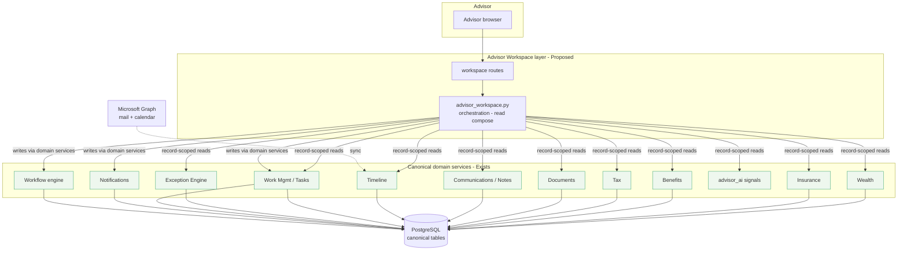

# Client360 — Advisor Workspace Architecture (Phase D)

> **Authoritative platform reference:** For the current, code-verified top-level architecture
> (domain map, source-of-truth matrix, dependency directions, capability inventory, scope and
> redaction models, and extension points), see **`docs/PLATFORM_ARCHITECTURE.md`** (Phase D.12A).
> For the **reasoning** behind the major architectural decisions, see the Architecture Decision
> Records index at **`docs/adr/README.md`** (Phase D.12B). This document remains the **detailed
> advisor-workspace evolution history** for Phases D.1–D.12 and is phase-specific rather than the
> single top-level reference.

**Status:** design / architecture reference (Phase D). No production code implied by
this document; nothing here is built until scoped into approved PRs.
**Baseline:** `release/0.13.0`.
**Depends on:** `PRODUCTION_ARCHITECTURE.md`, `WEALTH_ARCHITECTURE.md`,
`SPRINT_5_5_EXCEPTION_DESIGN.md`, `RELEASE_0.9.11_BENEFITS_ARCHITECTURE.md`,
`RELEASE_0.10.0_INSURANCE_ARCHITECTURE.md`, and ADRs `docs/architecture/adr/`.

**Tag convention.** `[Exists]` — building block already in the codebase.
`[Proposed]` — a new workspace-layer component this design introduces.
`[Policy-gated]` — requires a business/compliance decision before it may be enabled.

---

## 0. Objective, scope, and principles

### Objective
Design the **advisor's primary daily workspace**: one client-centric operational
cockpit that unifies every major Client360 domain (identity, household, wealth,
insurance, employee benefits, tax, documents, communications, tasks, exceptions,
opportunities, compliance) so a generalist advisor can run their day and conduct
client meetings from a single, coherent surface.

### What it is / is not
- **It is** an **orchestration / aggregation layer** over the existing canonical
  domains — a *lens*, not a new domain. It composes existing domain services into
  advisor-facing views.
- **It is not** a replacement for the domain **specialist consoles** (Tax Center,
  Benefits, Insurance, Exceptions). Those remain for domain specialists; the
  workspace is the generalist advisor's daily, client-first view over the same
  canonical data.
- **It does not fork** any engine (ADR-8: reuse the platform's assignment, queue,
  workflow, exception, notification engines — never duplicate them).

### Non-goals (explicit)
- No parallel data model. The workspace **reads** existing canonical tables via
  existing services; it introduces at most small **additive** workspace-only tables
  (e.g., saved views, meeting-prep artifacts), each a separate `[Policy-gated]` /
  reviewed decision.
- No autonomous advice. The intelligence layer **proposes**; humans decide (§4).
- No new regulated capability shipped ungoverned (§0 governance).

### Guiding principles (inherited)
1. **Client-centric composition.** The canonical **person/household** is the spine;
   every domain *references* it (ADR — data ownership). The workspace assembles a
   client view by composing domain reads keyed on the person/household id.
2. **Meeting-prep philosophy** (from `WEALTH_ARCHITECTURE.md`). Everything visible by
   default must answer one of: *What does this client own / owe / need? · What needs
   attention today? · What should I discuss?* Detail collapses; admin hides.
3. **Reuse over rebuild.** Exceptions → the Exception Engine; action items → Work
   Management/tasks; reviews → the Workflow engine; activity → Timeline; reminders →
   Notifications; meetings → Microsoft calendar sync.
4. **Capability + record scope on every read.** `require_capability` gates each
   surface; `accessible_person_ids` scopes every client list to the advisor's book.
5. **Propose, never act.** Intelligence and AI may surface candidates with evidence;
   they never mutate, file, reassign, or advise autonomously (Epic 6 governance;
   inert `NoopAIClassifier` until then).

### Governance (regulated advice) — read before §4
Several requested "advisor intelligence" items (Roth conversion candidates, tax
planning, insurance coverage gaps, retirement readiness, estate reminders,
business-owner planning) are **regulated advisory surfaces**. They are `[Policy-gated]`:
they may be **built to the mechanism boundary** but **enabled only** when (a) the firm
supplies the rules/thresholds (business/compliance policy — engineering never invents
them), and (b) an accountable **compliance owner** exists. This ties directly to
`V1_RISK_REGISTER.md` **GOV-2** (compliance-reviewer ownership) and `PRODUCT_DECISIONS.md`
**PD-4**. Until then, intelligence ships as **inert or advisory-only signals** with
safe defaults, mirroring the Wealth pattern (engine built, policy off).

---

## 1. Daily Dashboard

**Purpose:** the advisor's landing view — "what needs me today, across my book."
Triage, not deep work. Route `[Proposed]` `/workspace` (advisor home).

| Panel | Source (existing) | Notes |
|---|---|---|
| **My clients needing attention** | Exception Engine (`exceptions` scoped to the advisor's clients) + Advisor Intelligence signals (§4) | Ranked worklist; each row deep-links to the Client 360 Workspace. |
| **Meetings today** | Microsoft **calendar** sync data `[Exists]`; the advisor-scoped "today" list is a `[Proposed]` composition over that synced data (no per-advisor "meetings today" service exists yet) | Each meeting links to the **Meeting Workspace** (§3) pre-loaded for that client. |
| **Upcoming reviews** | Workflow engine (quarterly/annual review instances) + `accounts.last_review_date` (wealth) | "Due/overdue reviews" for the advisor's households. |
| **Compliance items** | Exception Engine `domain in {compliance, tax, insurance, benefits}` scoped to the advisor | Beneficiary gaps, suitability reviews, licensing (advisor's own), filing issues. |
| **Tasks** | Work Management (`tasks`, `work_items()`), My Work queue `[Exists]` | Open + overdue, advisor-assigned. |
| **Exceptions** | Exception Engine + `exception_reporting` `[Exists]` | Firm/record-scoped exception rollup for the advisor's book. |
| **Recent client activity** | `timeline_events` `[Exists]` | Cross-domain milestone feed (imports, communications, filings, enrollments) for the advisor's clients. |

**Design rules:** every panel is a **worklist that links into a client**; counts are
links, never dead ends; nothing here is deep work. The Daily Dashboard is the
**Wealth Dashboard pattern generalized to all domains** — book triage.

---

## 2. Client 360 Workspace

**Purpose:** the single client/household view for daily work and meeting prep. This
is an **evolution of the existing person profile** (`/people/{id}` with tabs Overview,
Timeline, Tasks, Documents, Notes, Activities, Calendar, Relationships, Portfolio
`[Exists]`) — extended to cover every domain and to lead with a **360 summary**.

Route `[Proposed]` `/workspace/clients/{person_id}` (household-aware).

### Layout (meeting-prep hierarchy)
- **360 Summary header (visible):** identity + household context; a **per-domain
  relationship snapshot** — wealth AUM, insurance in-force, and active tax/benefits
  engagements shown **side by side, not summed** into a single figure (the units are
  not comparable; a composite "relationship value" would be a separate, explicitly
  defined `[Policy/Design decision]`, not an arithmetic sum); attention badges (open
  exceptions, missing beneficiaries, upcoming reviews); and the **Meeting agenda**
  (open tasks/action items).
- **Domain sections (each references its canonical service — never duplicates it):**

| Section | Canonical source (existing) |
|---|---|
| **Identity** | `people` (+ `person_edit`) `[Exists]` |
| **Household** | `households`, `household_relationships`, `get_household_portfolio` `[Exists]` |
| **Wealth** | `get_person_portfolio` / `get_household_portfolio` + `wealth/components.html` macros `[Exists]` |
| **Insurance** | Insurance policies/coverage service (record-scoped) `[Exists]` |
| **Employee Benefits** | Person-linked via `benefit_employments.person_id` / `benefit_dependents.person_id` (client as employee/dependent) and org-linked via `benefit_plans.organization_id` (client as business owner, through `relationship_entities`) `[Exists]` |
| **Tax** | Tax engagements/returns/intake + document intelligence `[Exists]` |
| **Documents** | `documents` + `tax_document_links` + `microsoft_documents` (deterministic matcher) `[Exists]` |
| **Communications** | `person_notes` (typed, directional) + Microsoft mail sync `[Exists]` |
| **Timeline** | `timeline_events` `[Exists]` |
| **Tasks** | Work Management (`tasks`) `[Exists]` |
| **Notes** | `person_notes` `[Exists]` |
| **Opportunities** | Advisor Intelligence signals (§4) `[Proposed / Policy-gated]` |
| **Compliance** | Exception Engine (`domain`) + suitability/beneficiary/licensing signals `[Exists engine; some signals Policy-gated]` |

**Design rules:** the workspace **aggregates by `person_id` / `household_id`**; each
section is a **read of a domain service** scoped by `accessible_person_ids`. Sections
the advisor's client doesn't use (e.g., Employee Benefits for a non-business-owner)
**collapse or hide** — the workspace adapts to the client's relationship shape, it
does not show empty domains as noise. Household is the primary unit; individual is a
drill-down (the Wealth Household↔Client pattern, generalized).

---

## 3. Meeting Workspace

**Purpose:** a focused, single-screen surface an advisor keeps open **before and
during** a client meeting. Route `[Proposed]` `/workspace/meetings/{meeting_id}` (or
`/workspace/clients/{id}?mode=meeting`), pre-loaded from the calendar event.

| Element | Source | Notes |
|---|---|---|
| **Meeting preparation** | Composition of the Client 360 Workspace (§2), narrowed to meeting-relevant sections | One-screen brief: relationship value, allocation/coverage, open items. |
| **Agenda** | Open tasks + prior-meeting follow-ups (`tasks`) + advisor-authored agenda notes (`person_notes`) `[Exists]` | Editable; carries forward unresolved items. |
| **Open action items** | Work Management (`tasks` scoped to household) `[Exists]` | The "what we said we'd do" list. |
| **Financial changes** | Wealth: value/allocation/cash deltas since last review — **not** performance/return math (stays out per Wealth governance). **Blocked dependency:** a true "since last meeting" delta needs **historical portfolio snapshots**, which are *defined but not yet populated* (`WEALTH_ARCHITECTURE.md` §10, deferred snapshot work). Until snapshots exist, only **current** values are available (no delta). `[Blocked dependency]` | "What changed since we last met." |
| **Tax opportunities** | Advisor Intelligence (§4) — tax signals `[Policy-gated]` | Roth/RMD/harvesting **candidates**, human-confirmed. |
| **Insurance gaps** | Advisor Intelligence (§4) — coverage-gap signals `[Policy-gated]` | Proposed gaps vs. firm-defined coverage rules. |
| **Benefit opportunities** | Advisor Intelligence (§4) — benefits signals (business-owner clients) `[Policy-gated]` | Enrollment/renewal/service-line signals. |
| **Follow-up generation** | Work Management (`tasks`) + Notifications (canonical ledger + outbox, ADR-017) `[Exists]` | Turn meeting outcomes into tasks + client-facing follow-ups; **advisor-confirmed**, never auto-sent. |

**Design rules:** the Meeting Workspace **generates tasks and follow-ups through the
existing Work Management + Notification engines** — it does not invent a scheduling or
messaging system. Follow-ups are **drafted for advisor confirmation** (propose, not
act). "Financial changes" show stored-value deltas only; performance/return
methodology remains out of scope until governed (Wealth §12).

---

## 4. Advisor Intelligence

**Nature:** a **deterministic, propose-only signal layer** — *not* AI, *not*
autonomous advice. Two existing mechanisms are the substrate:

1. **`build_advisor_recommendations(summary, relationship_graph, portfolio)`**
   `[Exists]` — deterministic rules that emit human-facing next steps from
   candidate **flags** the caller supplies (`roth_conversion_candidate`,
   `rmd_candidate`, `high_unrealized_gains`, `tax_loss_candidates`,
   `accounts_requiring_beneficiary`, cash %, concentration %, days-since-contact,
   overdue tasks). The engine renders guidance **only when the candidate flag is set**;
   it does **not** itself decide eligibility.
2. **Domain detectors → Exception Engine** `[Exists]` — `insurance_detectors`
   (reviews overdue, licenses expiring, commission variance…), `tax_exception_detectors`
   (missing docs/organizer/signatures, client non-response, filing rejection…),
   `benefits_detectors` (eligibility unresolved, new-hire enrollment due, open-enrollment
   incomplete…). These emit **domain-scoped signals** with dedupe/auto-resolve.

| Requested item | Mechanism | Status |
|---|---|---|
| Cross-selling opportunities | Rules over the relationship graph (owns wealth but no insurance/benefits, business-owner without a plan) | `[Proposed / Policy-gated]` |
| Missing beneficiaries | Existing wealth predicate (`accounts_requiring_beneficiary` / IRA-without-active-beneficiary) → signal | `[Exists]` |
| Roth conversion candidates | `roth_conversion_candidate` flag → recommendation; **eligibility rule is firm/tax policy** | `[Policy-gated]` |
| Tax planning opportunities | Tax signals (harvesting, RMD, bracket) — **firm-defined thresholds** | `[Policy-gated]` |
| Retirement readiness | Rules over accounts/contributions vs. firm targets | `[Policy-gated]` |
| Estate planning reminders | Beneficiary/trust/document-expiry signals | `[Policy-gated]` |
| Insurance coverage gaps | Coverage vs. firm-defined need rules | `[Policy-gated]` |
| Business-owner planning | Organization/benefits signals for business-owner households | `[Policy-gated]` |

**Governance invariants (non-negotiable):**
- **Propose, never act.** Every signal is a **candidate** requiring human review;
  none mutates records, files, sends, or reassigns.
- **Evidence + human decision recorded** for regulated proposals (mirror the
  document-matching/workflow-evidence pattern — decisions written to an append-only
  ledger).
- **Policy is the firm's, mechanism is engineering's.** Engineering builds the rule
  engine to the boundary; the firm supplies thresholds/rules; nothing regulated is
  enabled without a **compliance owner** (GOV-2 / PD-4).
- **AI stays inert** (`NoopAIClassifier`) until Epic 6's governed AI (propose-only,
  explainable, human-confirmed).

---

## 5. Workflow Architecture

All cadences run on the **existing Workflow engine** (versioned templates, dependency
sequencing, SLA/escalation, approvals — ADR-016) and the **scheduler** (detector
scans, SLA sweeps). The workspace **surfaces and launches** these; it does not embed a
second state machine (ADR-8).

| Cadence | Composition | Engine |
|---|---|---|
| **Daily** | Daily Dashboard triage → clear exceptions/tasks; prep today's meetings | Exception Engine, Work Management, calendar `[Exists]` |
| **Weekly** | Book review: upcoming reviews, aging exceptions, unresolved follow-ups; capacity (Team Work) | `exception_reporting`, work queues `[Exists]` |
| **Quarterly review** | A **workflow template** per household: assemble the Client 360 brief → advisor review → meeting → follow-ups → closeout | Workflow engine template `[Proposed template on Exists engine]` |
| **Annual review** | Superset of quarterly: + beneficiary/estate check, coverage review, tax-year planning, compliance attestations | Workflow template + Advisor Intelligence signals `[Proposed / Policy-gated]` |

**Design rules:** review cadences are **workflow templates** (data, not code), so
content/steps are governed and versioned; the workspace renders the active instance
and its checklist. Follow-ups become **tasks** (Work Management), reminders become
**notifications** (ADR-017).

---

## 6. Navigation Architecture

```
Advisor Workspace  [Proposed top-level nav group]
├── Today            /workspace                 (Daily Dashboard §1)
├── Clients          /workspace/clients         (book list → Client 360 §2)
│     └── Client     /workspace/clients/{id}     (Client 360 Workspace)
│           └── Meeting  /workspace/clients/{id}?mode=meeting  (Meeting Workspace §3)
└── Reviews          /workspace/reviews          (active review workflows §5)

Specialist consoles (unchanged, for domain specialists):
  Wealth (/wealth, /portfolio) · Tax (/tax) · Benefits (/benefits, /organizations)
  · Insurance (/insurance) · Oversight (/exceptions) · Work (/work)
```

**Design rules:**
- The Advisor Workspace is a **new sidebar group**; the existing domain groups
  (Wealth, Tax, Benefits, Insurance, Oversight, Work) **remain** for specialists.
- **Nav gating mirrors route capability** (the existing `base.html` pattern): an item
  shows only if the advisor could open it (never shown-then-403). The workspace group
  requires the advisor's client-read + record scope.
- **Deep-linking is the connective tissue:** dashboard worklists → client; client
  domain sections → the specialist console filtered to that client; meeting → follow-up
  tasks. One consistent design system (`app.css` + `wealth/components.html` macros,
  extended into shared workspace components — §9).

---

## 7. Service Architecture

**New layer (thin orchestration) `[Proposed]`:** `app/services/advisor_workspace.py`
— composes existing domain services into workspace view-models. It **owns no
business logic and no aggregation math**; it calls domain services and shapes the
result, exactly as the routes do today.

```
Routes  [Proposed]  app/routes/workspace.py
   /workspace · /workspace/clients/{id} · /workspace/meetings/{id} · /workspace/reviews
        │  (require_capability + accessible_person_ids on every read)
        ▼
Orchestration  [Proposed]  app/services/advisor_workspace.py
   get_daily_dashboard(advisor)      → composes: exceptions, tasks, calendar,
                                        reviews, timeline, intelligence signals
   get_client_360(person_id)         → composes: identity, household, wealth,
                                        insurance, benefits, tax, documents,
                                        communications, timeline, tasks, notes,
                                        opportunities, compliance
   get_meeting_workspace(meeting)    → narrows client_360 + agenda + follow-ups
        │  (calls, never forks, the domain services below)
        ▼
Domain services  [Exists]
   portfolio.py · insurance_* · benefits_* · tax_* · documents · person_notes ·
   timeline · work_management · exception_engine / exception_reporting ·
   advisor_ai.build_advisor_recommendations · notification_dispatch · workflow engine
        ▼
Security  [Exists]   require_capability · accessible_person_ids · record scope · audit
        ▼
Data  [Exists]       canonical PostgreSQL tables (no new domain tables)
```

**Design rules:**
- **One aggregation truth per domain.** The workspace never re-implements a domain's
  math (e.g., it calls `get_household_portfolio`, never re-sums AUM). This is the
  Wealth canonical-contract lesson generalized.
- **Record scope is applied once, at the boundary**, and threaded to every domain
  read (`accessible_person_ids`); no domain read may widen scope.
- **Composition is read-only.** Mutations (create task, draft follow-up, launch
  review) go through the **existing** domain services (Work Management, Notifications,
  Workflow), which keep their audit and capability checks.

---

## 8. Data Flow



**Read path:** advisor → workspace route (capability + scope) → orchestration →
fan-out of **record-scoped reads** to domain services → composed view-model → render.
**Write path:** meeting/review actions → **domain services** (tasks, notifications,
workflow) → canonical tables (audited). **Ingestion** (imports, mail/calendar sync,
detector scans) is unchanged and feeds the same canonical tables the workspace reads.

---

## 9. Extension Guidelines

- **Adding a domain section to the Client 360 Workspace:** add a read to
  `advisor_workspace.get_client_360()` that calls the domain's **existing** service
  scoped by `accessible_person_ids`, and render it with a **shared workspace
  component**. Never query a domain's tables directly from the workspace layer.
- **Shared UI components:** extend the Wealth pattern — presentation-only macros
  (`wealth/components.html` → a broader `workspace/components.html`) consuming
  **canonical** view-model keys. Pages compose; components render (no logic in
  components). Normalize each domain's view-model to a canonical shape first (the
  PR-2 lesson).
- **Adding a Daily Dashboard panel:** it must be a **record-scoped worklist that
  links into a client** and answers one of the three questions; a count with no
  destination is not allowed.
- **Adding an intelligence signal:** implement it as a **deterministic rule or a
  detector** (Exception Engine), propose-only, with the candidate-flag/threshold
  supplied by firm policy. Regulated signals stay `[Policy-gated]` (safe-default off)
  until a compliance owner exists.
- **Adding a review cadence/step:** author it as a **workflow template** (versioned
  data), not code; render the instance in the workspace.
- **Generating follow-ups/reminders:** always through Work Management (tasks) +
  Notifications (ADR-017); advisor-confirmed; never auto-sent.
- **New workspace-only persistence** (saved views, meeting artifacts): additive,
  reversible migration; single Alembic head; treat as a reviewed decision, not a
  drive-by table.

---

## 10. Items requiring architecture review before modification

1. **The "no forked engine" boundary (ADR-8).** The workspace must never re-implement
   assignment, queue, workflow, exception, or notification logic. Any proposal to add
   workspace-local versions of these requires ARB review.
2. **Read-composition, not data duplication.** Introducing a workspace-owned parallel
   data model (denormalized client store, cached aggregates) changes the architecture
   and needs review — measurement must prove live composition insufficient first.
3. **Record-scope threading.** The single-boundary scope model
   (`accessible_person_ids`) is a correctness/privacy control; any change to how scope
   is applied across the composed reads is security-critical (record boundary; cf.
   the cross-client exposure lessons).
4. **Advisor Intelligence governance.** Turning any `[Policy-gated]` signal from
   propose-only into anything that auto-acts, auto-sends, or renders regulated advice
   without human confirmation — or enabling it without a compliance owner (GOV-2/PD-4)
   — is prohibited without compliance + ARB review.
5. **AI enablement.** Replacing the inert `NoopAIClassifier` with any live model
   (Epic 6) requires the governed-AI review (propose-only, evidence, human decision).
6. **Regulated financial surfaces.** Performance/return math, billing/fees, IPS,
   drift, rebalancing, model portfolios remain **out** (Wealth §12) until governed;
   "Financial changes" in the Meeting Workspace shows stored-value deltas only.
7. **Canonical vocabulary.** Each domain view-model normalized into the workspace must
   keep a single canonical key set (the Wealth PR-2 lesson); renames/reshapes that
   ripple across shared components need review.
8. **Scheduler/scale.** New detector scans or workspace jobs run on the in-process
   scheduler (single-instance / leader-election constraint, ADR-10); adding jobs
   interacts with that deployment constraint.

---

## 11. Compliance gate & decision-evidence boundary (Phase D.7)

A **human-controlled** compliance review layer sits above Advisor Intelligence for
governed **Advisor Recommendations** (the `[Policy-gated]` signals of §4). It is a
governance/evidence layer, **not** an execution or automation layer, and preserves the
one-way dependency direction: `Advisor Intelligence → D.6 Rule Catalog → Compliance
Review Service → append-only Decision Ledger → read-only review UI`. Advisor
Intelligence never imports the compliance package; recommendation production never
depends on review status; a compliance decision never changes the deterministic
recommendation result. There is no generalized workflow engine — the lifecycle is a
small, explicit set of allowed transitions.

**Boundary invariants (non-negotiable):**
- **Compliance is human-controlled.** No automated approval, suitability determination,
  or regulatory certification. Approval, assignment, and every decision are recorded
  human actions; nothing changes state by rendering or reading a page.
- **Final regulated approval double-gates** on the `compliance.review.decide` capability
  **and** a recorded `ReviewerAuthority` (a factual, appropriately-licensed principal)
  **and** a Rule-Catalog version match. Absent any of these the review is
  `blocked_pending_authorized_reviewer` and no approval is recorded. Authority is never
  inferred from a job-title string; no reviewer is fabricated (the authority catalog is
  seeded empty — see `V1_RISK_REGISTER.md` GOV-2 / `PRODUCT_DECISIONS.md` PD-4).
- **Decision evidence is append-only and snapshotted.** The recommendation, its
  evidence, the governing rule, and the rule version are snapshotted at submission; the
  decision ledger blocks UPDATE/DELETE; corrections create a new superseding decision.
- **Advisor-facing rendering is unchanged.** Review status is not shown in the Advisor
  Workspace this phase (to preserve the deterministic advisor output); advisor-facing
  status display is deferred future integration.

**Sign-off artifact.** A recorded compliance sign-off is a decision-ledger row capturing
rule-set version (governing rule + rule version), reviewer, reviewer role, date, scope
reviewed, approval status, and comments/exceptions. **It records a human review decision;
it is not an electronic signature and not an independent regulatory certification.** See
`docs/PHASE_D7_COMPLIANCE_REVIEW_LEDGER.md`.

**Reviewer authority boundary (Phase D.8).** Whether a final approval is *permitted* is
governed by administratively-maintained `ReviewerAuthority` records
(`docs/PHASE_D8_REVIEWER_AUTHORITY_ADMINISTRATION.md`): an authorized administrator
(`compliance.authority.manage`) records authority from documented facts with segregation
of duties (actor ≠ subject; no self-administration), an explicit lifecycle
(draft/active/suspended/expired/revoked/superseded), and an append-only event history.
Authority scope is a set of governed rule ids and/or policy-gate categories; an empty
scope confers nothing and authority is never inferred from a role/title. Recording
authority never auto-approves a blocked review. **Authority records are factual
administrative metadata — not electronic signatures, not licensing verification, not
regulatory certification; the system does not determine legal qualification.**

---

## 12. Activity Timeline projection (Phase D.10)

A read-only **projection** sits beneath the existing domains and composes their events into
one advisor-facing chronological view per client/household — it is **not** a new system of
record. It reads existing authoritative records only (`timeline_events`, `advisor_work_events`
/`advisor_work_items`, `compliance_reviews`/`compliance_decisions`) through explicit per-domain
adapters, and never mutates them. Dependency direction is strictly downward: **source domains
never import the timeline**.

```
Existing domain records  →  Activity Timeline projection  →  Client / Household Timeline
```

**Invariants:** deterministic ordering `(occurred_at desc, stable event-id desc)`; stable event
ids; bounded queries (≤500/source, ≤100/page); `timeline.read` capability **plus** person/household
record scope, and **not** a bypass around `advisor_work.read`/`compliance.review.read`;
**server-side redaction** (confidential work notes and compliance comments show "Additional details
are restricted."); Advisor Intelligence recommendations are **excluded** (no durable occurrence
timestamp — never fabricated). The timeline is advisor-facing and curated — it is **not** the
administrative audit log (`/admin/audit`) and does not replace it. See
`docs/PHASE_D10_CLIENT_HOUSEHOLD_ACTIVITY_TIMELINE.md`.

## 13. Annual Review Workspace — composition layer (Phase D.11)

A **composition layer** sits above the existing domains and assembles them into one
advisor-facing workspace for annual client reviews, answering *"what do I need to review with
this client today?"* It **consumes** existing services read-only — it is not a new system of
record and duplicates no business logic.

```
Client360 · Advisor Intelligence · Advisor Work · Activity Timeline ·
Compliance · Meeting Workspace · Portfolio  →  Annual Review Service  →  Annual Review Workspace
```

Eight read-first sections (client snapshot, advisor-intelligence summary, outstanding advisor
work, recent activity, compliance summary, portfolio overview, meeting preparation, review
checklist) each reuse the owning domain's service. Advisor Intelligence is **reused, never
regenerated**; the portfolio is reused from the meeting-brief snapshot (no recomputation, no
new calculations). Two additive, person-scoped reads (`advisor_work.person_work`,
`compliance.reviews.person_reviews`) were added to the owning services (existing behavior
untouched).

**Dependency direction is strictly downward: source domains never import Annual Review**
(test-enforced). The only new persistence is `annual_review_sessions` — a mutable
advisor-activity record (notes + a presentation-only checklist) with an explicit status set
(`draft → in_progress → completed → archived`); it never changes a source-domain record. No
workflow engine.

**Invariants:** capabilities `annual_review.read/create/update` (server-side); person **record
scope** enforced in the service (the route is outside the `^/(people|households)` RECORD_PATH);
`annual_review.*` is **not a bypass** — each section is gated on its owning capability
(`advisor_work.read` / `timeline.read` / `compliance.review.read`) and omitted otherwise;
"Start review" is idempotent (partial-unique OPEN guard); recommendation ids and all source
domains are unchanged. Client 360 gains an **"Annual review →"** link; it is otherwise
unchanged. See `docs/PHASE_D11_ANNUAL_REVIEW_WORKSPACE.md`.

## 14. Business Owner Planning Workspace — composition layer (Phase D.12)

A composition + structured-data layer over existing domains for business-owner clients,
answering *"what planning opportunities, risks, obligations, and follow-up items exist across
this client's businesses?"* It **consumes** existing services read-only and is not a planning
engine — no tax calculation, plan design, insurance placement, valuation, or automation.

```
Business Entities · Tax · Retirement · Benefits · Insurance · Advisor Intelligence · Advisor
Work · Activity Timeline · Compliance · Annual Review  →  Business Owner Planning Service
                                                       →  /business-owner/{person_id}[/business/{id}]
```

The workspace is anchored to a **person** and reaches their businesses through the existing
ownership graph (`relationship_entities`/`relationship_ownership`) via a **pure read** — never
inferring ownership from a name/occupation/free text, and never creating an entity as a
rendering side effect. Business-owner status comes only from an active ownership edge.

The audit proved that succession / continuity / buy-sell / valuation / key-person facts have
**no authoritative home**, so D.12 introduces exactly one table — `business_planning_profiles`
(1:1 per business, controlled status vocabulary) — and nothing else; it duplicates no
business/ownership/tax/retirement/benefits/insurance/work/compliance/annual-review data. Tax,
retirement, benefits, and insurance are reused via additive person/business-scoped reads on the
owning services (existing behavior unchanged). Owner compensation, policy purpose, and tax
return content are **absent upstream** and shown as "Not available / not tracked" — never
fabricated.

**Invariants:** capabilities `business_owner.read/update/planning_update` (server-side); person
record scope + a validated business relationship (ownership or org scope) gate every business
(blocks URL enumeration); each composed section is gated on its OWNING capability
(tax/benefits/insurance/organization/advisor_work/timeline/compliance/annual_review) —
**restricted ≠ missing**; EIN decrypts only with `benefits.sensitive.read`, policy numbers only
with `insurance.sensitive.read`; recommendations are reused (grouped by durable
`recommendation_type`, no second engine); missing-information is deterministic (no AI); the only
mutation is the planning profile, which emits durable events through the shared timeline writer
(no second event table). Client 360 gains a "Business owner planning →" link and the household
profile an optional bounded ownership summary; both are otherwise unchanged. See
`docs/PHASE_D12_BUSINESS_OWNER_PLANNING_WORKSPACE.md`.

---

## 15. Personalized Advisor Home — widget grid, personalization & AI-ready summaries (Phase D.38)

D.38 turns `/workspace` from a fixed daily dashboard into the **personalized advisor home**, on top of
the D.36/D.37 read infrastructure. It **extends** the existing surface (no new home, no forked engine)
and adds three things, all composition/read-only:

**Widget grid (12 widgets).** `app/services/workspace/registry.py` declares 12 widgets — Today's
Calendar, Active Clients, Workflow Exceptions, Operational Tasks, Recent Activity, Revenue Pipeline,
Compliance Queue, Tax / Insurance / Benefits pipelines, Document Review, Team Workload. Each declares
the capability that gates it, its section, and a deep link into the owning surface (no dead-end tiles).
`widgets.py` computes each: **count** widgets read the D.37 projection-backed analytics sources (served
from a projection when healthy+fresh on the firm-wide `record.read_all` path, else the authoritative,
record-scoped fallback — behavior unchanged by default); **list** widgets call the existing
record-scoped read services. A widget the principal cannot open is never assembled (no shown-then-403);
a widget that raises is isolated so it can never break the home. Above the grid: a greeting, a **TODAY**
summary row, and a **PRIORITIES** panel (deterministic High/Medium/Low bucketing of the daily
dashboard's attention items — no AI, no new data).

**Personalization (view state only).** Two new tables — `workspace_preferences` (one row per user:
widget order / hidden / pinned / remembered filters) and `workspace_presets` (named saved layouts).
These store UI settings, not business data: no authoritative state, no ledger, self-service (always the
acting user's own `user_id`), gated by a new non-sensitive capability `workspace.personalize` (the page
stays `client.read`). Reorder / hide / pin / reset / save-preset / apply-preset are **POST-form**
(POST-redirect-GET) at `/workspace/customize|presets|reset`, matching the app's no-JS convention — no
client-side framework introduced.

**AI-ready summary models.** `summaries.py` exposes five clean, structured, read-only dicts a future
natural-language assistant can consume without changing the dashboard: **Daily Brief**, **Client
Snapshot**, **Meeting Prep**, **Opportunity Summary**, **Compliance Summary** — served as JSON at
`/workspace/summaries/*` (person-scoped summaries enforce record-scope → 404 out of scope). No AI logic
is added in this phase; only the consumable shape.

Invariants: the authoritative services remain the sole mutation layer; the transactional outbox remains
the sole event bus; projections stay disposable; RBAC/record-scope is never bypassed; behavior is
unchanged until an operator enables + rebuilds projections. See ADR-043. Enforcement:
`app/services/workspace/*`, `app/routes/workspace.py`, `app/database/workspace_tables.py`, migration
`k2w3s4p5r6f7`, `app/templates/workspace/{dashboard,_widgets}.html`, `tests/test_advisor_workspace_home.py`.

**D.39 integration:** the workspace adds five Unified Work Queue widgets — My Work, Overdue Work, Due
Today, Unassigned Team Work, SLA Breaches — that deep-link into filtered `/work` views. They read from
the ONE shared queue-summary service (`work_queue.summary`), so the queue query logic is not duplicated
in the workspace, and D.38 personalization (order/hide/pin/presets) applies to them unchanged. The
Unified Work Queue (`GET /work`) is the operational execution surface linked from this home; see
`docs/UNIFIED_WORK_QUEUE.md` and ADR-044.

## Cross-references
- `WEALTH_ARCHITECTURE.md` — the exemplar workspace pattern (meeting-prep hierarchy,
  canonical contract, shared components, propose-not-act) this design generalizes.
- `PRODUCTION_ARCHITECTURE.md` — services, routes, auth, scheduler, workflow, audit.
- `SPRINT_5_5_EXCEPTION_DESIGN.md` / `ADR_EXCEPTION_ENGINE_SCOPE.md` — the signal
  substrate for attention/compliance/opportunities.
- `RELEASE_0.9.11_BENEFITS_ARCHITECTURE.md`, `RELEASE_0.10.0_INSURANCE_ARCHITECTURE.md`
  — the benefits/insurance domain services the workspace composes.
- `V1_RISK_REGISTER.md` (GOV-2), `PRODUCT_DECISIONS.md` (PD-4) — the compliance-owner
  gates on regulated intelligence.
- `docs/architecture/adr/` — ADR-016 (workflow), ADR-017 (notifications), plus the
  reuse/data-ownership/security ADRs this design honors.

*Architecture only. No production code, schema, migration, route, service, template,
or configuration was created or modified in producing this document.*
