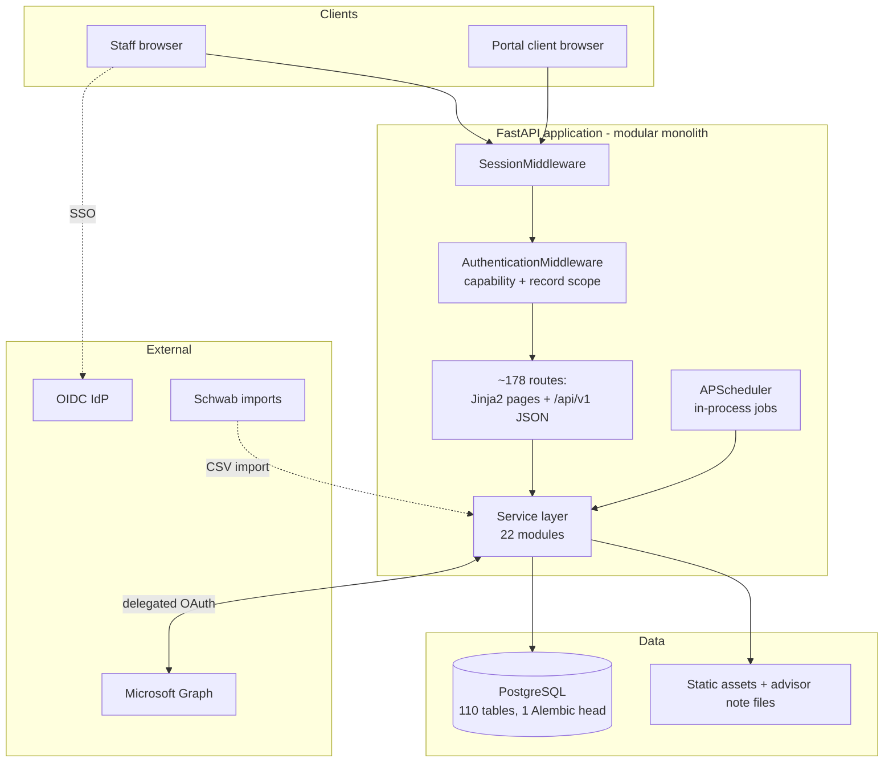
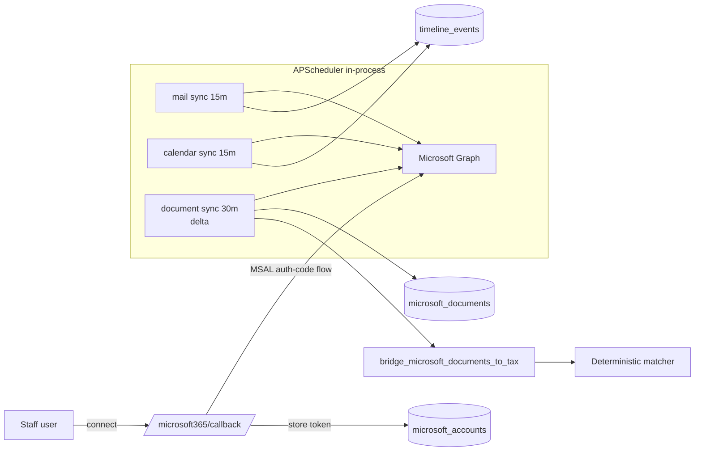
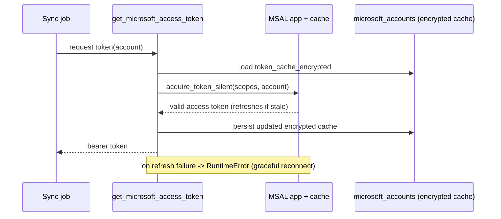
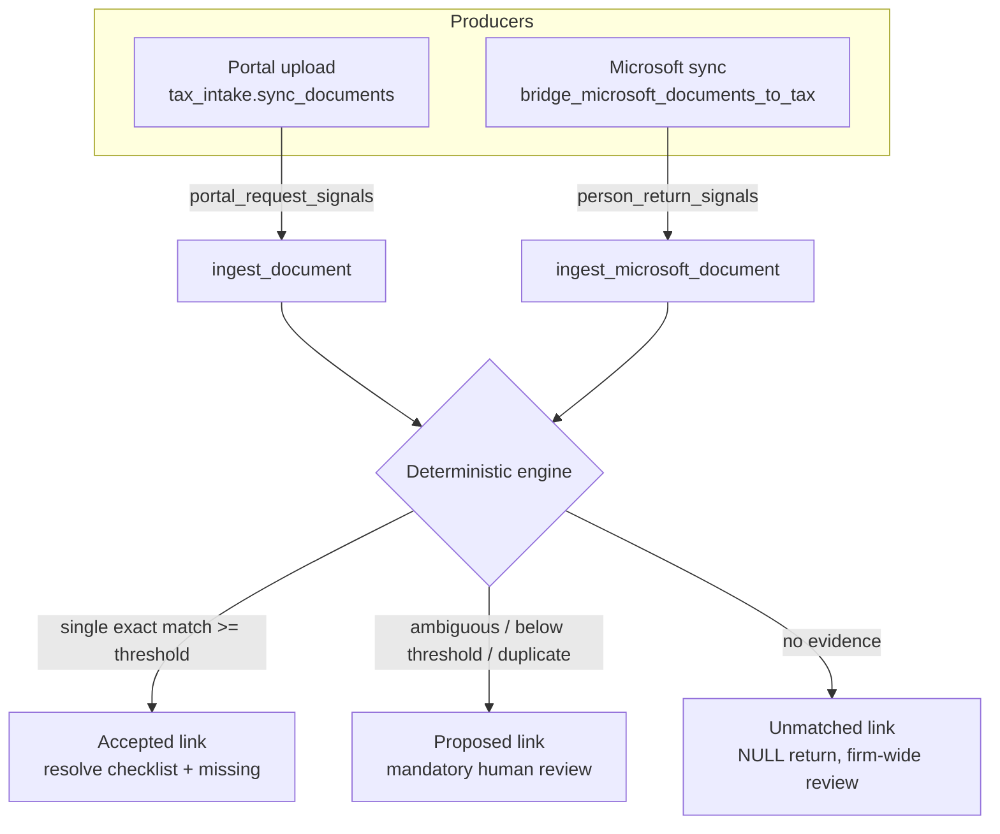
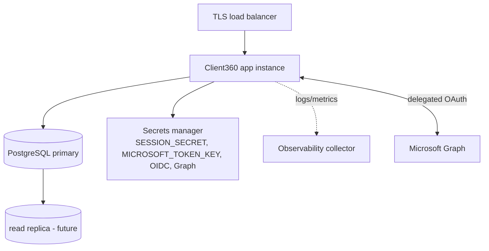

# Client360 — Production Architecture

**Status:** authoritative architecture reference for Client360.
**As of:** Release v0.9.8 (`main` @ `8d27e95`, Alembic head `l2c03f1e0d9b`).
**Governs:** all subsequent design and implementation, including
`docs/RELEASE_0.9.9_PLATFORM_CONSOLIDATION.md`.

**Reading convention.** This document describes the architecture that **actually
exists today** and marks forward-looking elements explicitly:

- **[Implemented]** — shipped and in the codebase as of v0.9.8.
- **[Implemented: 0.9.9]** — shipped in Release 0.9.9 — Platform Consolidation.
- **[Planned: Epic 5/6]** — later tax sprints or Epic 6.
- **[Gap]** — a known, intentional deficiency with an owner in the roadmap.

---

## 1. Executive Architecture Overview

Client360 is a unified client-intelligence and practice-management platform for
360 Wealth Consulting and 360 Tax Solutions. It is a **modular monolith**: one
FastAPI application, one PostgreSQL database (110 tables, single linear Alembic
history), server-rendered Jinja2 staff/portal UIs plus versioned JSON APIs, and
an in-process background scheduler.

Core design tenets, consistently honored across nine releases:

- **Canonical ownership.** People, households, relationship entities, documents,
  timeline, assignments, queues, workflows, portal grants, and audit are the
  single sources of truth; new domains (e.g. tax) *reference* them rather than
  forking parallel engines.
- **Capability-based authorization** with record-level scoping and immutable
  append-only audit.
- **Provider-neutral integration** through adapters (Microsoft Graph, OIDC,
  e-signature, filing) so vendors are swappable.
- **Additive, reversible migrations** with a single head and sentinel-preservation
  validation every release.
- **Adversarial release gates** (RC-series independent validation) before merge.

The platform is functionally rich and architecturally sound; the principal
production gaps closed in Release 0.9.9 were Microsoft 365 token security
**[Implemented: 0.9.9]** and dashboard/query performance **[Implemented: 0.9.9]**;
the remaining focus is the operational
readiness gates (see §20–§22).

---

## 2. System Context

Actors and external systems:

- **Staff users** (advisors, operations, tax preparers/reviewers, compliance,
  administrators) — browser, authenticated via **OIDC**. **[Implemented]**
- **Portal clients** (taxpayers, spouses, delegates) — browser, authenticated via
  a **separate portal identity system** (invitation/MFA-ready). **[Implemented]**
- **Microsoft 365 / Graph** — Outlook mail & calendar, SharePoint/OneDrive.
  **[Implemented]**
- **Schwab** — portfolio data (import-based today). **[Implemented]**
- **OIDC identity provider** — staff SSO. **[Implemented, provider-neutral]**
- **E-signature / e-file / transcript / notification providers** — abstracted
  ports; only manual/stub implementations wired today. **[Planned: Epic 5/6]**

---

## 3. High-Level Architecture Diagram

---

## 4. Application Architecture

**Stack [Implemented].** FastAPI 0.128 + Starlette 0.49 on Uvicorn 0.39; Jinja2
3.1 server-rendered templates; SQLAlchemy 2.0 **Core** (not ORM — tables are
`Table` objects, queries via `select()/insert()/update()`); Alembic 1.16;
APScheduler 3.11; MSAL 1.37; `cryptography` 49; `psycopg2-binary`.

**Layering [Implemented].**

- **Routes** (`app/routes/*`, 32 modules) — HTTP boundary, capability dependencies,
  request/response shaping. Staff HTML + `/api/v1` JSON + portal.
- **Services** (`app/services/*`, 22 modules) — business logic; the trusted API.
- **Security** (`app/security/*`) — middleware, models, policy, canonical
  authorization service, audit, redaction, bootstrap, OIDC-adjacent utilities.
- **Portal** (`app/portal/*`) — the separate client identity/messaging/signature
  subsystem.
- **Jobs** (`app/jobs/*`) — scheduler and Microsoft sync jobs.
- **Data access** (`app/db.py`, `app/database/*`) — see §5.

**Request pipeline [Implemented].** `SessionMiddleware` (outermost) decodes the
signed session cookie → `AuthenticationMiddleware` resolves the staff or portal
principal, enforces coarse capability by URL rule, record-scope for
`/people|/households|/documents|/relationships`, CSRF (Origin check), writes audit
for mutations, and sets security headers → route handler enforces fine-grained
`require_capability` and record/office/portal scope.

**Entrypoint [Implemented].** `app/main.py` builds the app, mounts `/static`, adds
the two middlewares, registers all routers, and manages the scheduler via the
FastAPI lifespan.

**[Gap]** Server-rendered UI uses three inconsistent conventions (raw f-string
HTML, standalone templates, ``); API responses lack a shared envelope
and `response_model`. Consolidation is Epic 7 part 2 (Release 0.9.13).

---

## 5. Database Architecture

**Engine [Implemented].** PostgreSQL; SQLAlchemy Core; **110 tables**; one linear
Alembic history (22 migrations; head `l2c03f1e0d9b`). Migrations are additive and
reversible; each release validates clean base→head, prior-version
upgrade/downgrade/re-upgrade, and sentinel row-count/checksum preservation.

**Table families.** CRM (people, households, source matching, tasks, activities,
documents+versions, timeline); relationships (entities + typed edges); portfolio
(Schwab accounts/holdings/lots/performance/beneficiaries/rollups); identity/RBAC
(users, roles, capabilities, role_capabilities, user_roles, teams, memberships,
record_assignments, sessions); audit; work management (assignment
rules/events/details, queues); workflow (templates, steps, dependencies, events,
approvals, escalations, triggers, actions); portal (accounts, grants, invitations,
sessions, threads, messages, receipts, requests, notifications, signature
requests); Microsoft (accounts, drives, documents, matching rules, unmatched
queues); tax (~40 tables across domain, intake, lifecycle, document intelligence).

**Integrity patterns [Implemented].** DB-trigger-protected append-only ledgers
(`audit_events`, workflow events, timeline, tax lifecycle/filing/document events);
idempotency-key uniqueness; snapshot-on-launch for workflow templates; partial
unique indexes (e.g. one accepted document link per source/return); CHECK
constraints and FK indexes on the newer tax/document tables.

**Data-access split [Implemented, Gap].** `app/db.py` calls
`metadata.reflect(bind=engine)` at import and re-exports ~103 tables (the de-facto
runtime source of truth); `app/database/schema.py` (+ `identity_tables.py`,
`work_tables.py`, `portfolio_tables.py`) define static `Table` models for ~half
the schema, used mainly by migrations and `person_merge`. **[Gap]** ~50% of tables
have no Python model; the app cannot start without a live, migrated DB.
Consolidation is Epic 7 part 2.

**Known debt.** The 24 hot-path FK/hot-column indexes were added in **0.9.9**
**[Implemented: 0.9.9]** (remaining low-value FK columns intentionally left
unindexed);
free-text status/type columns lacking CHECK/lookup enforcement and `json`→`jsonb`
(0.9.13); no partitioning/retention for unbounded event tables (post-1.0);
advisor notes stored as flat files outside the DB (0.9.9 candidate).

---

## 6. Authentication Architecture

Two independent identity systems sharing the Starlette signed session cookie by
distinct keys.

- **Staff [Implemented].** OIDC-only (`app/integrations/identity/oidc.py`,
  provider-neutral via a base adapter). On callback, a server-side session is
  created; the browser holds an opaque `session_token` validated against a
  **SHA-256 hash** in `user_sessions`. `secrets.compare_digest` guards OIDC state.
  No home-grown password storage.
- **Portal [Implemented].** Separate `portal_session_token`; invitation-acceptance
  creates sessions; tokens are `secrets.token_urlsafe(32)`, stored hashed,
  single-use, row-locked on redemption; MFA-ready.
- **Cookie/session [Implemented].** `SameSite=lax`; `Secure` in production;
  `itsdangerous`-signed session.

**[Implemented: 0.9.9]** `SESSION_SECRET` fails production boot when unset and
logs a loud startup warning on the development fallback. No returning-user portal login, no password-reset
delivery, no portal document download (Epic 5 Sprint 5.7 / portal launch gates).

---

## 7. Authorization Architecture

**Model [Implemented].** Capability-based RBAC: **26 capabilities** composed into
**4 seeded roles** (administrator, advisor, operations, compliance). A `Principal`
carries a capability frozenset; `require_capability(code)` gates routes.

**Record-level scoping [Implemented].** `record_assignments` (user/team,
effective/inactive dated) plus `record.read_all` / `record.write_all` bypass grant
access to specific person/household records; tax adds office-membership scope;
portal uses household/delegated grants. The **canonical authorization service**
(`app/security/authorization.py`, added in v0.9.7 hardening) centralizes
`record_in_scope`, `assignment_manageable`, and `accessible_person_ids`.

**Two enforcement layers [Implemented].** (1) `AuthenticationMiddleware` infers a
coarse capability from a URL `RULES` regex table (with carve-outs so dedicated
capabilities like `work.approve`, `tax.review`, `tax.document.review` are not
shadowed by a `.write` inference — the H4 lesson) and applies record/relationship/
document scope for record paths; (2) route handlers enforce fine-grained
capability and record/office/portal scope. Segregation of duties is enforced for
approvals; denied high-risk mutations emit immutable `outcome="denied"` audit
events.

**[Gap]** Three historically-divergent record-scope implementations
(`has_record_scope`, `_scope_filter`, `authorized_assignments`) still coexist;
unification onto the canonical service is Epic 7 part 2 (RC9 Release-1.0 item).

---

## 8. Microsoft 365 Integration Architecture

**Implemented.** Delegated OAuth auth-code flow via MSAL; delta-aware
SharePoint/OneDrive document sync; mail and calendar sync into canonical timeline;
unmatched review queues; Microsoft documents feed the tax document engine (v0.9.8).
`app/connectors/microsoft365/config.py` supplies tenant/client config.

**[Implemented: 0.9.9].** OAuth tokens are now stored as a **Fernet-encrypted MSAL
cache** with a durable **silent-refresh** lifecycle (§9), replacing the former
plaintext-token / ~1-hour-failure mode. Over-broad scopes (`Mail.Send`,
`*.ReadWrite`) were reduced to read-only, and per-account **sync-health** is
surfaced. The unused app-only Graph client (~600 lines) was removed. Still
post-1.0: multi-account sync and throttling/backoff (single "most recently
connected" account; single-page mail/calendar fetches).

---

## 9. OAuth and Refresh-Token Lifecycle

**Today [Implemented, Gap].** `acquire_token_by_auth_code_flow` returns an access
token; `refresh_token=None` is persisted; sync jobs read the plaintext
`access_token` and raise `RuntimeError("reconnect Microsoft 365")` on expiry.

**[Implemented: 0.9.9]** (governing design: `RELEASE_0.9.9_PLATFORM_CONSOLIDATION.md` §4–5):

- `offline_access` requested so MSAL issues a refresh token.
- The MSAL **SerializableTokenCache** is persisted **encrypted** (Fernet, keyed by
  a secrets-managed `MICROSOFT_TOKEN_KEY`, fail-closed if absent).
- Lazy silent refresh at call time (no extra timer); graceful degradation to the
  existing reconnect error on genuine re-consent.
- Existing accounts re-connect once (no usable refresh token exists today — not a
  new regression).

---

## 10. Background Jobs and Scheduler Architecture

**Implemented.** `APScheduler` `BackgroundScheduler` (timezone
`America/New_York`), started/stopped in the FastAPI lifespan, running: Microsoft
mail sync (15m), calendar sync (15m), document sync (30m), workflow SLA/escalation
evaluation (5m), and daily tax intake reminders (9:00 AM ET). Each job is wrapped
in a blanket `try/except` with `logger.exception`.

**[Gap].** The scheduler is **in-process with no leader election** — running
multiple app replicas would duplicate every job (and can race the escalation
insert). Documented as a deployment constraint in 0.9.9; single-instance-or-leader
-election is required before horizontal scaling. Escalation records are write-only
(no consumption path); the automation-action engine is modeled but unwired
(Epic 4 debt).

---

## 11. Document Ingestion Pipeline

**Implemented (v0.9.8).** Two producers feed one engine: portal uploads
(deterministic request provenance) via `ingest_document`, and Microsoft documents
via `bridge_microsoft_documents_to_tax → ingest_microsoft_document`. Links use a
**dual-source model** — a `tax_document_links` row references *either* a canonical
`documents` row **or** a `microsoft_documents` row (exactly-one-source CHECK) — so
no binary is duplicated. Ingestion is idempotent; unmatched documents persist
reviewably (NULL return, no fabricated ownership); accepted links resolve the
checklist item and missing-information records.

---

## 12. Deterministic Document Matching Pipeline

**Implemented (v0.9.8).** Ownership is established **only** from exact,
deterministic identifiers — never substring/containment (this eliminated RC8 H13
cross-client exposure):

- **Signals & weights:** portal-request provenance 1.0, exact drive/folder-id rule
  0.95, exact uploader-email identity 0.90, prior manual decision 1.0. Fuzzy hints
  never contribute to the score.
- **Decision:** auto-accept requires a single candidate ≥ **0.90** with no
  competing candidate ≥ the **0.50** ambiguity floor; everything else → mandatory
  human review; duplicates (exact hash) → duplicate review.
- **Ownership validation:** accept/reassign re-validate the document owner against
  the target return's client/household; cross-owner mismatches are denied (403) with
  an immutable audit event, even when the reviewer is authorized for the return.
- **Review workflow:** accept/reject/reassign/classify/duplicate/revert, each
  record-scope authorized, status-guarded (409 on stale actions), and written to an
  append-only review/evidence ledger.
- **Governance:** validated by RC11 + retest (43/43 adversarial checks; H13
  unbreakable across nine datasets).

---

## 13. Audit and Event Architecture

**Implemented.** `audit_events` is an append-only, **DB-trigger-protected**
immutable log (UPDATE/DELETE rejected). Mutations (route-level and service-level)
write audit events with actor, action, entity, outcome, request id, IP, and
redacted metadata; **denied high-risk mutations** are audited with
`outcome="denied"` (v0.9.7+). Parallel append-only ledgers exist for workflow
events, timeline events, assignment events, portal messages/receipts, and tax
lifecycle/filing/document events. Timeline publishes client-facing milestones
(never sensitive content).

**[Gap].** Sensitive **reads** (viewing tax return detail, portal threads) are not
audited; metadata redaction is shallow (top-level, substring keyword). Minor
hardening candidates for 0.9.9/later.

---

## 14. Workflow Architecture

**Implemented (Epic 4, Release 0.9.2).** Immutable **versioned templates** with
complete launch-time snapshots; dependency-aware sequential/parallel/conditional
execution; pause/resume/cancel/complete/reopen; **independent approvals** with
segregation-of-duties (DB CHECK + service enforcement); SLA evaluation with
idempotent escalations (5-minute scheduler); event-driven triggers and an
idempotent automation-action ledger. Published templates and workflow/audit
ledgers are trigger-protected. Tax engagements/returns *reference* workflow
instances rather than embedding a second state machine.

**[Gap].** Automation-action execution and multi-level escalation
consumption/resolution are modeled but not fully wired (Epic 4 debt).

---

## 15. Queue Architecture

**Implemented.** `work_queues` are reusable, criteria-driven (JSON criteria over
work items) with a `required_capability`; **30 seeded queues** span work, tax
production, tax document review, etc. Queue membership is computed from the
authorized work-item set, so queues never bypass record scope. The same queue
service backs My Work, Team Work, and all tax/document review queues (no
queue-only parallel definitions).

**[Gap].** `work_queues.required_capability` is defined but not yet enforced by the
queue-view routes; queue-item computation rides on the `work_items()` full-scan
(performance target for 0.9.9).

---

## 16. API Architecture

**Implemented.** ~178 routes; ~90 under `/api/v1` (tax, work, workflow, portal,
session) plus staff HTML pages and a few unversioned JSON endpoints
(`/api/stats`, `/api/search`, `/admin/*`). Every endpoint enforces capability and,
where applicable, record/office/portal scope; mutations are audited; consistent
`x-request-id` and security headers.

**[Gap].** No shared response envelope (each router invents a key; 17+ shapes); no
`response_model`/OpenAPI schema; no pagination convention (one ad-hoc `limit`);
inconsistent exception→status mapping. Standardization is Epic 7 part 2
(Release 0.9.13).

---

## 17. External Integration Architecture

Provider-neutral adapter pattern **[Implemented for OIDC + Graph config; abstracted
elsewhere]**. Since Release 0.9.9 Phase 3 the portal registries share a single
canonical `app.portal.providers.ProviderRegistry` (label-parameterized), replacing
the former duplicate per-domain registry classes:

- **OIDC** — provider-neutral staff SSO adapter. **[Implemented]**
- **Microsoft Graph** — single delegated-OAuth path via
  `services/microsoft_identity.py` (encrypted MSAL cache + silent refresh, Phase 1);
  config via `connectors/microsoft365/config.py`. **[Implemented]**
- **E-signature** — signature port on the canonical `ProviderRegistry`
  (`portal/signatures.py`); persistence + timeline wired, concrete provider
  reserved for Epic 5 Sprint 5.6. **[Port implemented, provider unwired]**
- **Filing (e-file)** — `TaxFilingProvider` port, manual provider only; reserved
  for Epic 5 Sprint 5.6. **[Reserved: unwired]**
- **Notifications** — provider-neutral hooks; email/SMS/push disabled by default.
  **[Implemented port, stubbed delivery]**
- **Schwab** — CSV/file import. **[Implemented]**
- **Transcript / additional custodians / QuickBooks** — **[Planned: Epic 6]**

---

## 18. Security Boundaries

- **Identity boundary:** staff vs portal identities are separate systems
  (different session keys, different principals, different routes). **[Implemented]**
- **Capability boundary:** every route requires a capability; least privilege via
  composed roles. **[Implemented]**
- **Record boundary:** person/household/office/portal scope filters every
  data-returning path; cross-client access is denied and (for high-risk mutations)
  audited. **[Implemented; consolidation pending]**
- **Immutability boundary:** audit and event ledgers are append-only at the DB
  layer. **[Implemented]**
- **Tenant boundary (Microsoft):** enforced by the Azure app-registration
  authority; not independently re-checked in code. **[Gap: verify at deploy]**
- **CSRF boundary:** Origin check on mutations, with a **Referer fallback** when
  Origin is absent, + `SameSite=lax`. **[Implemented: 0.9.9]**

---

## 19. Encryption and Secrets Management

**Today [Implemented / Gap].** In transit: TLS at the deployment edge (out of app
scope). At rest: application relies on database/disk encryption; **Microsoft OAuth
tokens are plaintext [Gap]**. Session tokens and portal tokens are stored **hashed**
(SHA-256), which is correct. `SESSION_SECRET` required in production but has a dev
fallback otherwise **[Gap]**. Secrets are read from the environment / `app/.env`
(gitignored); no vault/KMS integration **[Gap]**.

**[Implemented: 0.9.9].** Application-level **Fernet** encryption of the MSAL
token cache keyed by a secrets-managed `MICROSOFT_TOKEN_KEY` (fail-closed if
absent); documented key rotation (re-encrypt per account); the key must be backed
up separately from the database.

---

## 20. Backup and Disaster Recovery

**Today [Gap].** No documented backup/restore procedure or rehearsal; advisor
notes live outside the DB (flat files) and are not covered by a DB backup.

**[Implemented: 0.9.9 — backup/restore; advisor-notes-to-DB deferred]** (governing design: `RELEASE_0.9.9_PLATFORM_CONSOLIDATION.md` §14):
`pg_dump`/`pg_restore` runbook covering all 110 tables + the Alembic version
table; a **restore rehearsal gate** (restore → confirm single Alembic head → green
test suite → verify sentinel counts); explicit handling of the
`MICROSOFT_TOKEN_KEY` (backed up separately, or restored tokens are
undecryptable). Advisor-notes-to-DB migration is a durability candidate for 0.9.9.

---

## 21. Monitoring and Observability

**Today [Gap].** Jobs log via Python `logging`; `/health` reports config presence;
`/microsoft365/status` reports config only (not sync health). No metrics/alerting
integration; failures are server-log-only.

**[Implemented: 0.9.9]** (governing design: `RELEASE_0.9.9_PLATFORM_CONSOLIDATION.md` §12–13):
per-account Microsoft sync-health (`last_sync_at/status/error`) surfaced on
`/microsoft365/status` and a new `/readiness` endpoint (DB connectivity +
sync-health + Alembic head); structured operational log fields (job, counts,
duration, outcome) for an external collector; documented operator queries for
denied-mutation and sync-failure monitoring. `/health` remains a DB-independent
liveness probe.

---

## 22. Production Deployment Topology

**Recommended target topology** (constraints reflect today's architecture):

- **Single application instance** today because the in-process scheduler has no
  leader election **[Gap]**; horizontal scaling requires
  single-instance-scheduler or leader election (0.9.9 documents the constraint).
- PostgreSQL primary; read replica is a future scalability option (§23).
- Secrets (session secret, Microsoft token key, OIDC, Graph config) from a secrets
  manager; TLS terminated at the edge.
- Deployment prerequisite: exactly one Alembic head; sequential upgrade preserves
  data; never `metadata.create_all()`.

---

## 23. Scalability Strategy

- **Vertical first** — the modular monolith scales well vertically for the firm's
  scale. **[Current]**
- **Query/index optimization** — eliminate N+1 dashboards and add missing indexes
  so per-request cost is O(caller's book), not O(firm). **[Implemented: 0.9.9]**
- **Read replicas** for reporting/read-heavy paths once queries are index-bound.
  **[Planned: post-1.0]**
- **Horizontal app scaling** — requires scheduler leader election (extract the
  scheduler into a single worker, or add a distributed lock). **[Planned: post-1.0]**
- **Event-table partitioning/retention** for the unbounded append-only ledgers.
  **[Planned: post-1.0]**
- **Materialized reporting** only where measurement proves live queries
  insufficient. **[Planned: Epic 5 Sprint 5.8 / post-1.0]**

---

## 24. AI Integration Points (future Epic 6)

**Today [Implemented].** An **inert interface-only** classifier port
(`TaxDocumentClassifier` / `NoopAIClassifier`) exists in the document intelligence
service; it makes no external call and no decision. Enabling any provider requires
explicit approval.

**Planned [Epic 6].** Governed AI document classification and tax-fact extraction
behind the existing port; AI recommendation ports with **evidence capture and
human-decision records**; AI meeting prep / client briefs / relationship-aware
recommendations. Governance invariant: AI may propose but never autonomously
approve, file, deliver, reassign, or override deadlines; all inputs are minimized
and outputs are explainable and human-confirmed.

---

## 25. Architectural Decision Records (ADR Summary)

| ADR | Decision | Status | Rationale |
|---|---|---|---|
| ADR-1 | Modular monolith (single FastAPI app + one PostgreSQL) | Implemented | Right scale for the firm; simpler ops than microservices |
| ADR-2 | SQLAlchemy **Core** (not ORM) | Implemented | Explicit SQL, predictable performance; team preference |
| ADR-3 | Capability-based RBAC composed into roles | Implemented | Least privilege; roles are data, not code |
| ADR-4 | Record-level scoping via `record_assignments` + bypass caps | Implemented | Per-client isolation; office/portal extensions |
| ADR-5 | Immutable append-only audit + event ledgers (DB triggers) | Implemented | Tamper-evident compliance history |
| ADR-6 | Single linear Alembic history, additive/reversible, one head | Implemented | Safe, auditable schema evolution |
| ADR-7 | Provider-neutral adapters (OIDC, Graph, e-file, e-sign, notify) | Implemented / partial | Swappable vendors; no lock-in |
| ADR-8 | Reuse platform engines; no forked assignment/queue/workflow/state machine | Implemented | Tax references, does not duplicate, the platform |
| ADR-9 | Server-rendered Jinja2 + versioned `/api/v1` JSON | Implemented | Fast staff UI now; API-ready for future clients |
| ADR-10 | In-process APScheduler | Implemented (constraint) | Simple; requires single instance / leader election to scale |
| ADR-11 | Deterministic-only document ownership matching (no substring) | Implemented (v0.9.8) | Eliminates cross-client exposure (H13); mandatory human review of ambiguity |
| ADR-12 | Dual-source document links (canonical OR Microsoft) | Implemented (v0.9.8) | One engine, two sources, no binary duplication |
| ADR-13 | Fernet-encrypted MSAL token cache + silent refresh | Implemented (0.9.9) | Remove plaintext-token risk; stop hourly sync failure |
| ADR-14 | Canonical authorization service; unify three scope implementations | Partial (0.9.7) → Epic 7 | Single source of authorization truth |
| ADR-15 | Shared API response envelope + pagination | Planned (Epic 7 / 0.9.13) | Enable a generic frontend client |
| ADR-16 | Inert AI port now; governed AI in Epic 6 | Implemented / Planned | Ship deterministic pipeline; add governed AI later |
| ADR-17 | Platform-wide Exception Engine (`exceptions`/`exception_events`/`exception_types` + required CHECK-constrained `domain`) rather than a tax-specific one | **Implemented (0.9.10 / Sprint 5.5, tax domain only)** — [RC13](RC13_VALIDATION.md)-validated; head `q7b58f6c5d4e` | Choosing the general model is nearly free now (one column + domain-aware scoping) but a breaking migration later; six domains already exhibit exception needs. See `docs/ADR_EXCEPTION_ENGINE_SCOPE.md` and `docs/SPRINT_5_5_EXCEPTION_DESIGN.md`. Guardrails: implement only `domain='tax'` this sprint; `domain` CHECK-constrained/extensible; domain-aware record-vs-firm scoping from day one; dedicated `exception.*` capability family (no broad `tax.*` re-grant). |
| ADR-18 | Organization as a first-class shared entity (existing `relationship_entities` + `organization_profiles`); a universal Engagement + service-line + relationship-role layer; benefits/retirement as the first service lines built on it | **Release candidate (0.9.11)** — implemented across Phases 1–8, [RC14](RC14_VALIDATION.md)-validated (**SAFE TO MERGE**, 0 defects); PR #22 draft, not tagged; head `u1f9c0i9h8g7` | Re-anchor employer operations on shared Client360 concepts instead of a benefits-only silo, reusing Person/Household, Documents, Work Management, the Exception Engine (`domain='benefits'`), the shared SLA sweep, the scheduler, the Portal, and `exception_reporting` — no second engine/scheduler/portal/workflow/reporting framework/data model. Tax converges onto the shared `engagements` model later (deferred). See `docs/RELEASE_0.9.11_BENEFITS_ARCHITECTURE.md`. Guardrails: Organization record scope on every staff/portal view; employer out-of-scope → 404; strict PII-free employer allowlist (no EIN/compensation/deferral/employee identity/internal notes/exceptions/escalation/ownership/queue internals); nothing inferred (verified dates only); additive/reversible; tax untouched. |

---

*This document reflects the architecture as implemented through Release v0.9.8,
with forward-looking elements explicitly marked. It governs subsequent design and
implementation. No application code was modified in producing it.*
