# Release 0.9.11 · Employer Operations on a Shared Client Platform — Architecture (Phase 0)

**Status:** Phase 0 — **architecture only, no code**. Revised per the "shared Client360
concepts" direction. For approval before any implementation.
**Baseline:** `main` @ v0.9.10, Alembic head `q7b58f6c5d4e`.
**Governing design:** `docs/PRODUCTION_ARCHITECTURE.md` (SQLAlchemy Core, capability RBAC,
domain-aware record-scope, immutable audit, additive/reversible migrations, single head,
thin routes over canonical services).
**New decision record:** **ADR-18 — Organization as a first-class shared entity; a universal
Engagement + Service-line + relationship-role layer; benefits/retirement as the first service
lines built on it** (summary in §13; added to `PRODUCTION_ARCHITECTURE.md` §25 at Phase 1).

> **Revision headline.** The prior draft modeled a benefits-only `benefit_employers` table.
> This revision **re-anchors benefits on shared Client360 concepts**: an **Organization**
> (the existing `relationship_entities`), **permanent relationship roles** (the existing
> `relationships`/`relationship_types` vocabulary), **service lines**, and a **universal
> Engagement** model (generalizing the existing `tax_engagements`). Benefits and **retirement
> (first-class from Phase 1)** become the first service lines delivered on this layer.
> Everything reuses Person, Household, Work Management, Documents + Document Intelligence,
> Timeline, Audit, the Exception Engine, and the Portal. **Betterment at Work** is the first
> seeded 401(k) recordkeeper; **no integration is built** (provider-neutral, provider stub
> only).

---

## 1. Reuse-vs-rebuild ledger (read this first)

The central instruction is *reuse what exists*. This table is the contract for the rest of
the document.

| Proposed concept | Already in Client360? | Decision |
|---|---|---|
| **Organization** (business/LLC/corp/partnership/nonprofit/trust/professional practice/related entity) | **Yes — `relationship_entities`** (`entity_type`, `person_id`, `household_id`, `name`, `details` JSON, `active`) | **REUSE + extend.** Add a 1:1 `organization_profiles` for operational fields; extend the `entity_type` vocabulary. **Do not** create `benefit_employers`. |
| **Employer** | No dedicated table | **A specialization, not a table:** an Organization that has a Benefits/Retirement **service line** + an `organization_profiles` row. |
| **Permanent relationship roles** (Advisor, Benefits Consultant, Tax Manager, Producer, Account Manager, CSR, Renewal Owner…) | **Partly — `relationships` + `relationship_types`** (directed, effective-dated, `category`) exist; but staff are `users`, not entities | **REUSE the role vocabulary + dated-ownership pattern.** Add one thin `organization_service_roles` bridge (staff `user` ↔ Organization) because staff aren't entities. External parties (CPA/attorney/broker) reuse `relationships` directly. **Not** Work Management. |
| **External parties** (CPA, attorney, banking, broker of record) | **Yes — `relationships` between entities** | **REUSE `relationships`** with professional-service role types. |
| **Service lines** (Tax/Wealth/Benefits/Retirement/Insurance/Bookkeeping/Payroll/Consulting/Estate) | No | **NEW** `service_lines` (ref) + `organization_service_lines` (M:N, status). |
| **Universal Engagement** | **Yes-ish — `tax_engagements`** anchors to `relationship_entity_id`/person/household with type+status+dates | **NEW shared `engagements`** for the new service lines; **`tax_engagements` stays** in 0.9.11. Convergence documented in §8 / §14 (do not replace tax now). |
| **Assignments (work)** | **Yes — `record_assignments`** (+ `assignment_events`, generic `entity_type`) | **REUSE unchanged** for work ownership on engagements/plans (`entity_type='engagement'`, …). Distinct from permanent roles. |
| **Documents + intelligence** | **Yes — `documents`/`document_versions` + tax classification engine** | **REUSE** via `benefit_document_links` + engagement/org links. |
| **Timeline / Audit / Exceptions / Portal** | **Yes** | **REUSE**: `timeline_events` (+`organization_id`), `write_audit_event`, Exception Engine (`domain='benefits'`), portal accounts/grants/Action Needed. |
| **Revenue tracking** | No | **NEW** lightweight `service_revenue` (relationship-management, **not** a GL). |
| **Cross-service opportunities** | No engine; but the **Exception Engine detector/reconcile pattern** is a reusable rules scaffold | **DESIGN now, defer build.** Reuse the detector pattern for a future `opportunities` capability. |
| **Plans / Retirement / Providers (Betterment)** | No | **NEW** benefits/retirement tables anchored to the Organization; provider-neutral. |

---

## 2. System boundaries (updated)

```
                         ┌──────────────────────── Shared Client Platform ───────────────────────┐
 Person ── Household     │  Organization (relationship_entities + organization_profiles)          │
   │          │          │     ├─ Service lines (organization_service_lines)                       │
   └──────────┴──────────┼──►  ├─ Permanent relationship roles (organization_service_roles +      │
        (reused as-is)   │     │      relationships/relationship_types)                            │
                         │     ├─ External parties (relationships: CPA/attorney/broker/bank)       │
                         │     ├─ Revenue (service_revenue)                                         │
                         │     └─ Engagements (engagements)  ── Work Mgmt · Docs · Timeline ·       │
                         │            │                          Audit · Exceptions · Portal ·      │
                         │            │                          Assignments · Due dates · Status   │
                         │  ┌─────────┴──────── Service-line detail (first two lines) ───────────┐  │
                         │  │  Benefits & Retirement:  Plans → Plan Years → Enrollments/Elections │  │
                         │  │     Providers (carrier/recordkeeper=Betterment/payroll — stubs)     │  │
                         │  └────────────────────────────────────────────────────────────────────┘ │
                         └───────────────────────────────────────────────────────────────────────┘
                (existing tax domain: tax_engagements stays; converges onto Engagements later — §8/§14)
```

- **In scope for 0.9.11 (Employer Operations MVP — §16):** Organization foundation, service
  lines, permanent roles, a minimal universal Engagement (used for benefits renewals),
  benefits **and retirement** plans, Betterment as a seeded provider, plan years/renewals,
  employee roster (reusing `people`), basic eligibility/enrollment/waiver/hire/term/QLE,
  employer & plan documents, work items, benefit exceptions, renewal workflow, employer
  dashboard, basic portal action items, basic operational reporting.
- **Out of scope (deferred — §16):** live carrier/Betterment/payroll/HRIS integrations,
  advanced PHI handling beyond the security architecture, complex dependent administration,
  full compliance automation, advanced analytics, commission/invoice reconciliation, complex
  enrollment-transaction modeling, and the cross-service **opportunity engine** build.

---

## 3. Entity definitions (updated)

- **Organization** — a `relationship_entities` row (`entity_type` ∈ business/llc/corporation/
  partnership/nonprofit/trust/estate/professional_practice/employer/…). The single, shared
  representation of any non-person party. An **Employer** is simply an Organization carrying a
  benefits/retirement service line and an `organization_profiles` row.
- **Organization profile** — 1:1 `organization_profiles` (EIN[encrypted], industry/NAICS,
  entity_type detail, renewal_month, status, address, employee-count band). Keeps
  `relationship_entities` lean.
- **Permanent relationship role** — a long-term ownership link (staff `user` ↔ Organization,
  optionally scoped to a service line) via `organization_service_roles`, using a
  `relationship_types` role code. Distinct from work assignments.
- **Service line** — a category of service 360 provides (`service_lines`); an Organization's
  active/prospect services are `organization_service_lines`.
- **Engagement** — a unit of delivered work anchored to an Organization (and/or person/
  household) within a service line, with a type, status, due date, and lifecycle. The
  universal successor to `tax_engagements`.
- **Benefit plan / Plan year / Enrollment / Retirement election** — the benefits/retirement
  service-line detail (unchanged intent from the prior draft, now anchored to the
  Organization).
- **Provider** — provider-neutral external platform (carrier / **recordkeeper (Betterment)** /
  payroll / HRIS / broker) in `benefit_providers`; integrations deferred.
- **Service revenue** — estimated/actual revenue by Organization × service line × category.
- **Opportunity** *(future)* — a detected cross-service gap.

---

## 4. Database design (changes)

Additive, reversible, single head preserved. New tables grouped by layer. Reflection-based
`app/db.py` gets an explicit global per new table.

### 4.1 Organization layer
- **`organization_profiles`** (1:1 with a `relationship_entities` org):
  `relationship_entity_id` (FK, unique), `legal_name`, `ein` **(encrypted)**, `industry`,
  `naics_code`, `entity_form` (`llc`/`c_corp`/`s_corp`/`partnership`/`nonprofit`/`trust`/
  `sole_prop`/`professional_practice` — CHECK), `employee_count_band`, `renewal_month`
  (1–12), `status` (`prospect`/`active`/`inactive` — CHECK), `address_json`, timestamps.
- **Extend `relationship_entities.entity_type`** vocabulary (data/seed) to include
  `employer`/`professional_practice` if not already present — no column change.
- **Extend `timeline_events`** → nullable `organization_id` (FK `relationship_entities`) for
  org-level events. (Was `employer_id` in the prior draft — now generalized.)

### 4.2 Relationship-role layer
- **`relationship_types` seed** → add servicing/role codes with `category='servicing'`:
  `advisor`, `benefits_consultant`, `tax_manager`, `tax_preparer`, `relationship_manager`,
  `primary_producer`, `secondary_producer`, `account_manager`, `service_rep`, `renewal_owner`;
  `category='professional'`: `cpa`, `attorney`, `banker`, `broker_of_record`; and
  `category='ownership'` / `category='org_structure'` (see §6A): `owns` (inverse `owned_by`),
  `parent_of` (inverse `subsidiary_of`), `affiliate_of`, `related_to`.
- **`relationship_ownership`** (1:1 typed detail on a `relationships` **ownership** edge — the
  one additive revision from the §6A validation): `relationship_id` (FK relationships, unique),
  `ownership_percentage` Numeric(5,2) **nullable = unknown**, `voting_percentage` Numeric(5,2)
  nullable, `ownership_type` str (`individual`/`joint`/`trust`/`entity`/`community_property`/…),
  `is_direct` bool (direct vs indirect), `evidence_source` str, `as_of_date` Date, `notes`.
  Reuses the edge's own `effective_date`/`inactive_date`/`source`/`active`; adds **only** the
  typed ownership quantities. **Not** a new ownership subsystem.
- **`organization_service_roles`** (permanent internal ownership — the thin bridge):
  `organization_id` (FK relationship_entities), `user_id` (FK users), `role_type_id` (FK
  relationship_types), `service_line_id` (FK service_lines, nullable), `is_primary` bool,
  `effective_date`, `inactive_date`, `created_by`. Reuses the role vocabulary + effective-
  dated pattern; **not** Work Management.
- **External parties reuse `relationships`** (org ↔ external entity, role via
  relationship_types) — no new table.

### 4.3 Service-line layer
- **`service_lines`** (ref seed): `code` (`tax`/`wealth`/`benefits`/`retirement`/`insurance`/
  `bookkeeping`/`payroll`/`consulting`/`estate_coordination`), `name`, `active`.
- **`organization_service_lines`**: `organization_id`, `service_line_id`, `status`
  (`prospect`/`active`/`inactive` — CHECK), `since_date`, `renewal_owner_user_id` (nullable),
  unique(`organization_id`,`service_line_id`).

### 4.4 Engagement layer
- **`engagements`** (universal): `id`, `organization_id` (FK relationship_entities, nullable),
  `person_id` (nullable), `household_id` (nullable), `service_line_id` (FK), `engagement_type`
  (str — e.g. `benefit_renewal`/`open_enrollment`/`new_group_implementation`/
  `401k_implementation`/`annual_retirement_review`/`wealth_review`/`insurance_review`/
  `tax_return`/`tax_planning`/`business_planning`), `title`, `status` (str — lifecycle per
  type), `due_date` (Date), `opened_on`, `closed_on`, `metadata` JSON, `created_by_user_id`,
  timestamps. **Bridge:** nullable `legacy_tax_engagement_id` (FK `tax_engagements`) for the
  documented future convergence (§8/§14). Engagements reuse Work Management
  (`record_assignments entity_type='engagement'`), Documents, Timeline, Audit, Exceptions
  (`related_entity_type='engagement'`), Portal, due dates, statuses.

### 4.5 Benefits & retirement layer (anchored to the Organization)
- **`benefit_plan_types`** (ref seed — full approved catalog, 17 types):

  | category | codes |
  |---|---|
  | health | `medical`, `dental`, `vision` |
  | income_protection | `group_life`, `std`, `ltd` |
  | supplemental_health | `accident`, `critical_illness`, `hospital_indemnity` |
  | spending_account | `hsa`, `fsa`, `hra` |
  | retirement | `401k`, `simple_ira`, `sep_ira`, `cash_balance` |
  | deferred_compensation | `deferred_comp` |

  `line_of_coverage` (`health`|`retirement`) discriminates for dashboards/detectors.
- **`benefit_providers`** (provider-neutral): `code`, `name`, `provider_type`
  (`carrier`/`recordkeeper`/`tpa`/`payroll`/`hris`/`broker` — CHECK), `line_of_coverage`
  (nullable), `active`. **Seed Betterment** (`provider_type='recordkeeper'`,
  `line_of_coverage='retirement'`, `code='betterment'`, name "Betterment at Work");
  Guideline/Human Interest/Vestwell/Empower added later as rows.
- **`benefit_plans`**: `organization_id` (FK relationship_entities), `plan_type_id`,
  `provider_id` (nullable), `engagement_id` (nullable — the setup/renewal engagement), `name`,
  `funding_type` (health: `fully_insured`/`level_funded`/`self_funded`; retirement:
  `trustee`/`custodial` — CHECK), `status` (`draft`/`active`/`renewing`/`terminated`),
  `effective_date`, `renewal_date`.
- **`benefit_retirement_plan_details`** (1:1 retirement plan): `plan_id`, `provider_id`
  (recordkeeper), `safe_harbor_type`, `match_formula`, `auto_enrollment`+`default_percent`,
  `vesting_schedule`, `eligibility_rule` JSON, `fiduciary_role` (`3(21)`/`3(38)`/`none`),
  `erisa` bool, `adoption_agreement_document_id`.
- **`benefit_plan_years`**: `plan_id`, `plan_year`, `effective_date`, `renewal_date`,
  `open_enrollment_start/end`, `status` (`upcoming`/`open_enrollment`/`active`/`closed`),
  unique(`plan_id`,`plan_year`).
- **`benefit_employments`** (Person ↔ Organization eligibility — **no duplicate person**):
  `person_id`, `organization_id`, `employee_status` (`active`/`terminated`/`cobra`/`retired`),
  `hire_date`, `termination_date`, `benefit_class`, unique(`person_id`,`organization_id`).
- **`benefit_enrollments`**: `benefit_employment_id`, `plan_year_id`, `coverage_tier`,
  `status` (`eligible`/`elected`/`enrolled`/`waived`/`terminated`/`cobra`), `elected_at`,
  `effective_date`, `end_date`, `source` (`staff`/`portal`/`import`),
  unique(`benefit_employment_id`,`plan_year_id`).
- **`benefit_retirement_elections`** (child of enrollment): `benefit_enrollment_id` (unique),
  `deferral_percent`, `roth_percent`, `contribution_type`, `auto_enrolled`, `vesting_snapshot`.
- **`benefit_dependents`** (reuse `people`): `benefit_enrollment_id`, `person_id`,
  `relationship`, dates, unique(`benefit_enrollment_id`,`person_id`).
- **`benefit_document_links`**: `document_id`, `organization_id`, `plan_id` (nullable),
  `plan_year_id` (nullable), `doc_kind` (spd/sbc/rate_sheet/census/adoption_agreement/
  invoice/enrollment_form/compliance_notice).
- **`benefit_provider_connections`** (design-ready, **inert**): `organization_id`,
  `provider_id`, `connection_type` (`recordkeeper`/`payroll`/`hris`), `status`
  (default `not_connected`), `last_sync_at`, `last_sync_status`, `metadata_json`,
  unique(`organization_id`,`provider_id`,`connection_type`). Source of "Betterment / payroll
  status (future)" dashboard tiles.

### 4.6 Revenue layer
- **`service_revenue`**: `organization_id`, `service_line_id`, `revenue_category`
  (`tax_fees`/`planning_fees`/`advisory`/`aum`/`benefits_commissions`/`insurance_commissions`/
  `retirement_plan_revenue`/`consulting`/`recurring` — CHECK), `amount_kind`
  (`estimated`/`actual` — CHECK), `amount` numeric, `period` (`annual`/`monthly`/`one_time`),
  `as_of_date`, `notes`, `created_by`. **Not** a GL; for relationship/profitability/opportunity
  reporting.

### 4.7 Opportunity layer *(future — design only)*
- **`opportunities`** *(later phase)*: `organization_id`, `opportunity_type`, `service_line_id`
  (the missing/target line), `status` (`open`/`pursuing`/`won`/`dismissed`), `detected_at`,
  `dedupe_key`, `metadata`. Populated by **opportunity detectors reusing the exception-engine
  detector/reconcile scaffold**. Not built in Phase 1 (§12).

### 4.8 Extensions to existing tables (additive, reversible)
1. `exceptions` + `exception_types` **domain CHECK** → add `'benefits'`.
2. `portal_access_grants` → nullable `organization_id` (FK relationship_entities);
   `access_type` values `employer_admin`/`employer_hr`; `portal_scope()` resolves org ids.
3. `timeline_events` → nullable `organization_id`.
4. `relationship_entities.entity_type` + `relationship_types` seed additions (data only).
5. Seeds: `service_lines`, `benefit_plan_types` (17), `benefit_providers` (+Betterment),
   benefits `exception_types`, `benefits.*` capabilities + roles, benefits work queues.

**No existing column is dropped or repurposed.** `tax_engagements` is **untouched** in 0.9.11.

### 4.9 Sensitive data
`ein`, SSN, and compensation encrypted at rest (`BENEFITS_FIELD_KEY`, Fernet pattern);
sensitive reads (health PHI + retirement financial PII) gated by `benefits.sensitive.read`.

---

## 5. Entity-relationship diagram

```mermaid
erDiagram
    relationship_entities ||--o| organization_profiles : "org profile (1:1)"
    relationship_entities ||--o{ organization_service_lines : "has service lines"
    service_lines ||--o{ organization_service_lines : classifies
    relationship_entities ||--o{ organization_service_roles : "permanent roles"
    users ||--o{ organization_service_roles : "staff owner"
    relationship_types ||--o{ organization_service_roles : "role vocab"
    relationship_entities ||--o{ relationships : "external parties (CPA/attorney/broker)"
    relationship_entities ||--o{ relationships : "owns / owned_by (person/household → org)"
    relationship_entities ||--o{ relationships : "parent/subsidiary/affiliate (org ↔ org)"
    relationships ||--o| relationship_ownership : "ownership % / voting / direct (1:1)"
    relationship_entities ||--o{ engagements : "engaged for"
    service_lines ||--o{ engagements : "within line"
    engagements ||--o| tax_engagements : "legacy bridge (future converge)"
    engagements ||--o{ record_assignments : "entity_type=engagement (work)"
    relationship_entities ||--o{ benefit_plans : sponsors
    benefit_plan_types ||--o{ benefit_plans : classifies
    benefit_providers ||--o{ benefit_plans : "carrier/recordkeeper (future)"
    benefit_plans ||--o| benefit_retirement_plan_details : "retirement config"
    benefit_plans ||--o{ benefit_plan_years : "plan year"
    relationship_entities ||--o{ benefit_employments : employs
    people ||--o{ benefit_employments : "is employee"
    benefit_employments ||--o{ benefit_enrollments : elects
    benefit_plan_years ||--o{ benefit_enrollments : "enrolled in"
    benefit_enrollments ||--o| benefit_retirement_elections : "deferral election"
    benefit_enrollments ||--o{ benefit_dependents : covers
    people ||--o{ benefit_dependents : "is dependent"
    relationship_entities ||--o{ benefit_provider_connections : "connection status (inert)"
    relationship_entities ||--o{ service_revenue : "revenue by line"
    service_lines ||--o{ service_revenue : categorizes
    relationship_entities ||--o{ opportunities : "cross-service gaps (future)"
    relationship_entities ||--o{ portal_access_grants : "employer portal (ext.)"
    relationship_entities ||--o{ exceptions : "domain=benefits (ext.)"
```



**Scope-resolution:** benefits/retirement rows resolve to the **Organization**
(`relationship_entities`) anchor; record-scope is evaluated there (plus the enrolled Person
for employee-level access). `record.read_all` ⇒ firm-wide.

---

## 6. Relationship-role model

- **Internal permanent roles** (Advisor, Benefits Consultant, Tax Manager, Tax Preparer,
  Relationship Manager, Primary/Secondary Producer, Account Manager, CSR/Service Rep, Renewal
  Owner): `organization_service_roles(organization_id, user_id, role_type_id, service_line_id?,
  is_primary, effective/inactive)`. Long-term ownership, effective-dated, optionally scoped to
  a service line (e.g. "Tax Manager" on the Tax line, "Renewal Owner" on Benefits).
- **Role vocabulary** reuses `relationship_types` (`category='servicing'`), so roles are
  configurable data, not code.
- **External parties** (CPA, attorney, banker, broker of record): reuse `relationships`
  (org ↔ external entity) with `category='professional'` role types; broker-of-record and
  recordkeeper additionally reference `benefit_providers`.
- **Distinct from Work Management.** `record_assignments` remains the *work* owner (who is
  doing this task/engagement now); `organization_service_roles` is the *relationship* owner
  (who owns this client long-term). No duplicate ownership system: one reuses the assignment
  substrate, the other reuses the relationship substrate.

---

## 6A. Organization structure & ownership — validation pass

Focused pre–Phase-1 review of Organization structure and ownership. Verified against the live
schema (`app/database/schema.py`: `relationship_entities`, `relationships`,
`relationship_types`) and `app/services/relationships.py`
(`ensure_person_entity`/`ensure_household_entity` + business/trust/estate/professional entity
creation).

### 6A.1 Decision — keep `organization_profiles` (1:1); do **not** fold into `relationship_entities`
| Consideration | Finding |
|---|---|
| **Separation of concerns** | `relationship_entities` is the **graph-node identity** (what exists + how it connects); employer operational fields (EIN/industry/renewal month/status/…) are **service-specific attributes** with a different lifecycle and owner. Different concerns. |
| **Existing uses** | `relationship_entities` is a **central, hot node**: FK'd twice by `relationships`, by `tax_engagements.relationship_entity_id`, and it **projects every Person and Household** (`ensure_person_entity`/`ensure_household_entity`). Widening it touches the busiest join target in the graph. |
| **Null-column growth** | ~10 employer columns would be **all-null** for every Person, Household, trust, estate, related entity, and prospect — the large majority of rows. Sparse columns on a core table. |
| **Migration risk** | `ALTER` adding 10 columns to a multiply-FK'd core table is **higher risk** (and can force rewrites/locks at scale) than creating one isolated 1:1 table. |
| **Query complexity** | Profile is needed only on **employer-detail** screens → one join there; frequent **graph traversals** stay narrow (they never select employer columns). Net simpler on the hot path. |
| **Record-scope authorization** | Scope resolves on **entity identity** (`relationship_entities`); the profile is attribute detail. Keeping identity lean keeps the authorization anchor unchanged. |
| **Reporting performance** | Relationship/graph reporting scans `relationship_entities`; a **narrow** table scans/caches better. Employer reporting joins the profile only when it needs those fields. |
| **Do all org types need a profile?** | **No.** A trust, estate, related entity, or prospect may never be an employer/client. An **optional 1:1** means "profile appears when the org becomes a client/employer"; extending the base table forces the columns onto entities that never use them. |

**Conclusion:** the separation is justified on **concrete** grounds (sparse null growth on a
central node, migration risk, hot-path leanness, optional-per-type) — not theoretical
normalization. **`organization_profiles` stays.**

### 6A.2 Household → Organization ownership (through the existing relationship graph)
Ownership is **represented through the relationship graph — not a new table and not
duplicated.** Households and people already project into `relationship_entities`
(`ensure_household_entity`/`ensure_person_entity`); organizations are `relationship_entities`
of an org `entity_type`.

> **Shelton Household owns 360 Wealth Consulting and 360 Tax Solutions**
> - `relationship_entities`: Shelton Household (household_id set), 360 Wealth Consulting (org),
>   360 Tax Solutions (org).
> - `relationships`: `(from = Shelton Household entity, to = 360 Wealth Consulting, type = owns)`
>   and `(from = Shelton Household entity, to = 360 Tax Solutions, type = owns)`.

**Both directions** are first-class because edges are directed with an `inverse_name`:
- **Household → owned organizations:** edges where `from_entity = household entity` and the
  type is an ownership type.
- **Organization → owner households/people:** edges where `to_entity = org entity`.

Ownership may be **modeled directly** (household entity → org) **and/or derived from Person
ownership** (member person → org, rolled up via household membership). We support both;
household-level holding uses a direct edge, individual holdings use person edges and roll up.

### 6A.3 Multiple organizations per owner + organization-to-organization structure
One owner → many orgs is just **many outgoing edges** (the unique key is
`(from, to, type)`, so distinct targets are unconstrained).

> **John Smith owns Smith Holdings, ABC Plumbing, ABC Rentals, ABC Management**
> → four `owns` edges from John Smith's person entity to four org entities.

**Org ↔ org** structure reuses the same graph with `category='org_structure'` types:
`parent_of`/`subsidiary_of` (e.g. Smith Holdings **parent_of** ABC Rentals), `affiliate_of`,
`related_to`. Fully supported; no new structure needed.

### 6A.4 Multiple owners + ownership percentages — the one minimal revision
One org with **multiple owners** = multiple **incoming** `owns` edges. However, the live
`relationships` edge carries only `effective_date`, `inactive_date`, `notes`,
`confidence_level`, `source` — it has **no** typed `ownership_percentage`, `voting_percentage`,
`ownership_type`, or `direct/indirect`. Storing percentages in `notes` would defeat
reporting/profitability aggregation.

**Smallest additive extension (not a new subsystem):** a **1:1 `relationship_ownership`**
detail keyed by `relationship_id` (§4.2) that adds only the typed ownership quantities and
reuses the edge's own dates/source/active. Percentages are **nullable = unknown**.

> **ABC Plumbing has two owners:**
> - edge `(John Smith → ABC Plumbing, owns)` + `relationship_ownership{ ownership%=60,
>   voting%=60, type=individual, is_direct=true, source="operating agreement" }`
> - edge `(Jane Smith → ABC Plumbing, owns)` + `relationship_ownership{ ownership%=40,
>   voting%=40, type=individual, is_direct=true }`
> **Indirect chain:** `(Smith Holdings → ABC Rentals, owns)` +
> `relationship_ownership{ ownership%=100, is_direct=false }` (Smith Holdings is itself owned
> by John Smith), so John's **indirect** interest in ABC Rentals is navigable via the graph.
> **Unknown %:** an edge with `relationship_ownership{ ownership_percentage = NULL }` records
> "owner known, share unknown."

This satisfies every requested attribute (owner person/household, org owned, ownership %,
ownership type, voting %, effective/end date [on the edge], direct/indirect, source/evidence,
notes, unknown %) **without** storing a percentage on the Organization record and **without** a
parallel ownership subsystem.

### 6A.5 Recommendation
**APPROVE PHASE 1 WITH THE DOCUMENTED REVISION** — keep `organization_profiles`; add the
single additive `relationship_ownership` 1:1 detail table plus the ownership/org-structure
`relationship_types` seeds. **Migration impact:** additive only (one new table FK'd to
`relationships`; data-only relationship-type seeds); no existing column changed; single head
preserved; no defect that blocks Phase 1.

## 7. Service-line model

`service_lines` seed: `tax`, `wealth`, `benefits`, `retirement`, `insurance`, `bookkeeping`,
`payroll`, `consulting`, `estate_coordination`. An Organization's active/prospect services are
`organization_service_lines` (M:N with status + `since_date` + optional renewal owner). This
is what powers "who buys what," cross-service opportunities (§12), and revenue attribution
(§11). Benefits and Retirement are the two lines whose detail tables ship in 0.9.11; the
others are catalog entries the platform is ready to attach engagements/revenue to.

---

## 8. Universal Engagement model (+ migration impact)

**Design.** `engagements` is the shared unit of work across service lines. Each engagement
carries `service_line_id`, `engagement_type`, `status`, `due_date`, lifecycle dates, and an
anchor (organization and/or person/household). It **reuses**: Work Management
(`record_assignments entity_type='engagement'`), Documents (`benefit_document_links` /
engagement doc links), Timeline (`add_timeline_event`), Audit (`write_audit_event`),
Exceptions (`related_entity_type='engagement'`, `domain='benefits'`), Portal, due dates, and
statuses. Benefits renewals, open enrollment, new-group implementation, 401(k)
implementation, and annual retirement review are all `engagements` in 0.9.11; wealth/insurance/
business-planning engagements are supported by the model and attached as those lines are built.

**Existing engagement-like architecture — `tax_engagements`.** It already anchors to
`relationship_entity_id`/person/household with type/status/dates and drives the tax lifecycle,
returns, intake, reviews, and filing. **We do not replace it in 0.9.11.**

**Migration impact & convergence plan (documented, deferred):**
- 0.9.11: `engagements` is **new and additive**; tax continues to use `tax_engagements`
  untouched. `engagements.legacy_tax_engagement_id` is a nullable bridge column for later.
- Future release (own sprint, own RC): converge tax onto `engagements` by (a) back-filling an
  `engagements` row per `tax_engagement` (service_line=`tax`, `legacy_tax_engagement_id` set),
  (b) repointing `tax_engagement_returns`/intake/review/exception references to the engagement
  id via a compatibility view or FK swap, (c) updating `app/services/tax_domain.py`,
  `tax_intake.py`, `tax_return_lifecycle.py`, and the tax routes. **Impact estimate:** ~1
  schema migration + ~4 service modules + tax route/template touch-ups + a dedicated RC;
  **non-trivial, so explicitly out of 0.9.11.** No tax behavior changes this release.

---

## 9. Benefits & retirement-plan model

- **Plan categories (17, approved):** Medical, Dental, Vision, Group Life, Short-Term
  Disability, Long-Term Disability, **Accident, Critical Illness, Hospital Indemnity**, HSA,
  FSA, HRA, 401(k), SIMPLE IRA, SEP IRA, Cash Balance Plan, Deferred Compensation — seeded in
  `benefit_plan_types` (§4.5) across health / income_protection / **supplemental_health** /
  spending_account / retirement / deferred_compensation.
- **Retirement is first-class from Phase 1**: a retirement plan is a `benefit_plan` with a
  `benefit_retirement_plan_details` row (safe harbor, match, vesting, auto-enroll, fiduciary
  role, ERISA, adoption agreement); participation is a `benefit_retirement_elections` child of
  enrollment (deferral %, Roth, auto-enroll). Health/welfare and retirement share one Employer
  → Plan → Plan Year → Enrollment spine; retirement specifics live in child tables.
- **Workflows** (engagements + `workflow_automation`): 401(k) onboarding, annual fiduciary
  review, census collection, eligibility, new-hire/auto-enrollment, plan amendments, annual
  notices, compliance reminders/testing, terminations, plus *future/inert* payroll-sync and
  provider-connection status.
- **Exception catalog** (`domain='benefits'`, reuses existing categories/severities/state
  machine; stable dedupe keys; auto-resolve/reopen): health — eligibility, new-hire, waiver,
  QLE, OE incomplete, census overdue/mismatch, SPD/SBC missing, renewal at risk, 5500 due,
  ACA risk, ERISA notice, invoice discrepancy; retirement — retirement eligibility, deferral
  election due, fiduciary review due, nondiscrimination test due, contribution deposit late
  (blocker), annual notice missing, plan amendment required; *future/inert* — carrier
  submission, payroll sync, provider connection. Compliance-category codes inherit
  `exception.compliance` segregation; blockers inherit `exception.resolve`.

---

## 10. Betterment provider treatment

- **Seeded, provider-neutral, no integration.** `benefit_providers` holds **Betterment at
  Work** as the first `recordkeeper` (`code='betterment'`, `line_of_coverage='retirement'`).
  Plans reference it by id only.
- **Connection status is honest and inert.** `benefit_provider_connections` defaults to
  `not_connected`; the dashboard's "Betterment connection status (future)" reads it. No
  credentials, no network calls.
- **Port stub (design):** `recordkeeper_providers.py` defines a `RecordkeeperProvider`
  protocol with a registered, **disabled** `BettermentRecordkeeperProvider` stub — shaped so
  Guideline / Human Interest / Vestwell / Empower are added as sibling stubs later. Adding a
  provider is a seed row + a stub, **never a schema change**.

---

## 11. Revenue model

`service_revenue` tracks **estimated or actual** revenue by **Organization × service line ×
category** (`tax_fees`, `planning_fees`, `advisory`, `aum`, `benefits_commissions`,
`insurance_commissions`, `retirement_plan_revenue`, `consulting`, `recurring`). It is a
**relationship-management** aid — for reporting, profitability views, and opportunity
identification — **not** a general ledger, invoicing, or accounting system. It has no journal
entries, no reconciliation, and no financial-close semantics. Reporting rolls it up by
organization, service line, and category, and joins to `organization_service_lines` to reveal
white space (a line with a relationship but no revenue, or revenue with no active line).

---

## 12. Cross-service opportunity design (future)

- **Concept.** An `opportunities` row is a **detected cross-service gap** for an Organization
  (or person/household), e.g.: tax client with no wealth relationship; employer with no
  benefits plan; benefits client with no retirement plan; employer with no key-person/buy-sell
  review; business owner with no retirement plan; wealth client with no tax-planning
  engagement; **employer using Betterment for 401(k) but no owner wealth relationship**.
- **Reuse, not rebuild.** These are exactly the shape the **Exception Engine detector +
  dedupe + reconcile** scaffold already handles: scan the shared graph
  (`organization_service_lines`, `engagements`, `benefit_plans`, `relationships`,
  `service_revenue`), emit/auto-close `opportunities` idempotently. The rule inputs already
  exist once §4 lands; opportunities differ from exceptions only in being *upside* not
  *problems*, so they get a **sibling table** (not `exceptions`) but the **same detector
  pattern**.
- **Phase-1 decision.** **Design now, build later.** The `opportunities` build is **deferred**
  (§16) — it is only worth doing after the Organization/service-line/engagement/revenue graph
  is populated. Because the detector scaffold is reusable, the later build is small; Phase 1
  ships the *data* that makes opportunities computable, not the engine.

---

## 13. Security model (updated)

**ADR-18 (summary):** *Organization (existing `relationship_entities`) is the shared
first-class party and top record-scope anchor for non-tax service lines; a universal
`engagements` model, a `service_lines` catalog, and a permanent relationship-role layer
(reusing `relationships`/`relationship_types`) sit on top; benefits and retirement are the
first service lines. All external platforms are one provider-neutral `benefit_providers`
abstraction (Betterment first recordkeeper, integrations deferred). Rationale: reuse over
rebuild (ADR-17 parity), avoid an isolated employer silo and a duplicate ownership system,
and keep tax convergence a documented future migration rather than a rewrite now.*

- **Capabilities:** new least-privilege `benefits.*` (`read`, `write`, `enroll`,
  `compliance` [sensitive], `sensitive.read` [sensitive — PHI + retirement PII]); a small
  `organization.*` family (`read`, `write`) for the shared org/role/service-line/revenue
  surface; benefits **exceptions reuse `exception.*`**. **No existing role widened; no new
  `record.read_all` grant.**
- **Roles:** `benefits_advisor`, `benefits_operations`, `benefits_compliance` (+
  `administrator`); existing roles gain `organization.read` where they already see clients.
- **Record-scope (domain-aware):** benefits/engagement rows resolve to the Organization
  anchor via `record_assignments` (`entity_type` ∈ `organization`/`engagement`/`benefit_*`)
  cascading to plans/enrollments; the exception engine's `_authorize` gains a benefits branch.
  Out-of-scope ⇒ 404; system callers bypass.
- **Sensitive data:** EIN/SSN/comp encrypted; `benefits.sensitive.read` gates PHI/financial
  detail; the employer portal never exposes cross-employer PHI/PII or retirement balances.
- **Audit:** every mutation → `write_audit_event`; exception ledger immutable; force-paths
  audited.

---

## 14. Migration impact on existing Client360 entities

| Existing entity | Change | Risk |
|---|---|---|
| `relationship_entities` | + 1:1 `organization_profiles`; seed extra `entity_type` values | **Low** — additive; no column change |
| `relationships` / `relationship_types` | seed new servicing/professional role types | **Low** — data only |
| `record_assignments` | new `entity_type` values (`organization`/`engagement`/`benefit_*`) | **None** — free-string column |
| `tax_engagements` | **untouched** in 0.9.11; future convergence onto `engagements` documented in §8 | **Deferred** — non-trivial; own sprint/RC |
| `exceptions` / `exception_types` | domain CHECK + `'benefits'` | **Low** — additive CHECK recreation |
| `portal_access_grants` | + nullable `organization_id`; new `access_type` values | **Low** — additive |
| `timeline_events` | + nullable `organization_id` | **Low** — additive |
| `people` / `households` | **reused as-is** (employees/dependents/contacts) | **None** |
| Exception Engine `_authorize` | + benefits branch (code, Phase 2/3) | **Low** — isolated |

No existing behavior changes this release; every schema change is additive/reversible; single
Alembic head maintained.

---

## 15. Portal, reporting, API (deltas from prior draft)

- **Portal:** employer HR/admin accounts scoped by `organization_id`; Action Needed allowlist
  (employer-safe) incl. retirement eligibility/deferral/notice + census; read-only on
  exceptions. Same no-leakage guarantees.
- **Reporting:** `benefits_reporting(principal, audience)` — health **and retirement**
  (participation, deferral %, fiduciary/testing status, deposit timeliness, renewals,
  compliance calendar, exception metrics, connection status). Plus **org/relationship
  reporting** (service lines per org, permanent roles, revenue by line/category, white space).
  Authorization-filtered; real data only.
- **API:** `/api/v1/organizations/*` (org, profile, service-lines, roles, revenue),
  `/api/v1/engagements/*`, `/api/v1/benefits/*` (plans incl. retirement-details, plan-years,
  employments, enrollments, retirement-elections, provider-connections[read-only], providers,
  census, report), reuse `/api/v1/exceptions?domain=benefits`; `/api/v1/portal/benefits/*`.
  Staff console `/benefits` + `/organizations` on the **modern shell** (names, not IDs).
  Carrier/recordkeeper(Betterment)/payroll/HRIS as **disabled ports**.

---

## 16. Revised Phase 1 scope (Employer Operations MVP for Angel)

**Goal:** a usable Employer Operations product. **In:**
- Organization foundation (`relationship_entities` + `organization_profiles`) + operational
  fields (EIN, industry, entity form, owners, primary/HR contact, broker of record,
  recordkeeper, CPA, attorney, banking, payroll/HRIS provider *references*, renewal month,
  status).
- Permanent relationship roles (`organization_service_roles` + role vocab).
- Service lines (`service_lines` + `organization_service_lines`) — at least Benefits &
  Retirement active.
- Benefit **and retirement** plans; **Betterment seeded** as recordkeeper; plan years &
  renewals.
- Employee roster reusing `people`; basic eligibility, enrollment, waiver, hire, termination,
  and qualifying-life-event tracking.
- Employer & plan documents (reuse Documents/intelligence).
- Work items (reuse Work Management); benefit exceptions (reuse Exception Engine); a
  **renewal workflow** (an `engagement`).
- Employer dashboard; basic portal action items; basic operational reporting.

**Deferred (out):** live carrier / **Betterment** / payroll / HRIS integrations; advanced PHI
handling beyond the security architecture; complex dependent administration; full compliance
automation; advanced analytics; commission & invoice reconciliation; complex enrollment-
transaction modeling; and the **cross-service opportunity engine build** (design only).

> Provider ports (carrier/recordkeeper/payroll/HRIS) are **registered but disabled** in
> Phase 1 so the model/workflows/dashboards support them; `benefit_provider_connections`
> stays `not_connected`. Revenue and opportunities are **designed** now; revenue schema may
> land in Phase 1 if cheap, but opportunity **detection** is deferred.

---

## 17. Updated phased implementation plan

Same cadence as Sprint 5.5 (one phase at a time, validate + regression, commit separately,
push, update a draft PR, **stop for review**; additive/reversible; single head each phase;
ADR-18 marked implemented only after the RC passes).

| Phase | Scope | Migration? |
|---|---|---|
| **0** | **This architecture (approval gate).** | none |
| **1** | Shared schema: `organization_profiles`, `service_lines`+`organization_service_lines`, `organization_service_roles`, `engagements` (+legacy bridge), `relationship_types`/`entity_type` seeds; benefits/retirement schema (plans, retirement-details, plan-years, employments, enrollments, retirement-elections, dependents, providers[+Betterment], provider-connections, document-links); extend exceptions domain CHECK, `portal_access_grants.organization_id`, `timeline_events.organization_id`; seed capabilities/roles/queues. | yes (additive/reversible) |
| **2** | Canonical services: `organization_service` (org/profile/roles/service-lines/revenue), `engagement_service`, `benefits_domain`, `benefits_enrollment`; extend `record_in_scope` + exception `_authorize`; field encryption; register **disabled** provider ports (carrier/recordkeeper[Betterment]/payroll/HRIS). | none |
| **3** | `benefits_detectors` (health + retirement) on `domain='benefits'`; renewal/eligibility/enrollment workflows as engagements. | none |
| **4** | **Work Management integration** (reordered — approved): benefits exceptions projected through `work_items()`; benefits queues; capacity/bottlenecks; assignment rules; **scheduled detector scan** (rider); **no second assignment model / scheduler**. | data-only (queues) |
| **5** | **Compliance/renewal calendar + SLA escalation + notifications** (reordered) via the existing sweep; honest outcomes; new compliance-obligations schema reviewed as its own increment. | (calendar schema) |
| **6** | Staff API + `/organizations` and `/benefits` consoles on the **modern shell** (names not IDs); reuse `/api/v1/exceptions?domain=benefits`. | none |
| **7** | Employer portal: Action Needed, census upload, enrollment/eligibility confirmation, notices, QLE, secure messages; org-scoped portal isolation. | none |
| **8** | Dashboards/reporting (benefits health+retirement **and** org/service-line/revenue) + **RC14 validation** + Release 0.9.11 docs. | none |
| **later** | Cross-service **opportunity** detectors; tax→`engagements` convergence; live integrations — each its own sprint/RC. | separate |

> The Phase-1 **product scope** for Angel (§16) is delivered across implementation phases 1–8
> of this release; the "Deferred" items are not started in 0.9.11.

---

## 18. Open questions for approval (recommendations noted)

- **O-1 · Organization = `relationship_entities` + `organization_profiles`** (recommended)
  vs. a new `organizations` table. *Recommend reuse — avoids an isolated silo; tax already
  anchors to `relationship_entities`.*
- **O-2 · Permanent roles = thin `organization_service_roles` bridge** reusing
  `relationship_types` vocab (recommended, because staff are `users` not entities) vs. forcing
  everything through `relationships`. *Recommend the bridge.*
- **O-3 · Engagement**: new additive `engagements` now, **tax converges later** with the §8
  documented impact (recommended) vs. generalizing `tax_engagements` in place now. *Recommend
  additive + deferred convergence — no tax risk in 0.9.11.*
- **O-4 · Revenue in Phase 1**: land `service_revenue` **schema** in Phase 1 (cheap, unlocks
  reporting/opportunity data) but keep entry UI minimal vs. fully defer. *Recommend: schema +
  minimal entry in Phase 1; rich revenue UX later.*
- **O-5 · Opportunities**: **design now, build later** reusing the detector scaffold
  (recommended) vs. attempt a minimal build in Phase 1. *Recommend defer build — data first.*
- **O-6 · Provider scope**: one `benefit_providers` covering carrier/recordkeeper/payroll/
  hris/broker (recommended) vs. per-type tables. *Recommend one provider-neutral table.*
- **O-7 · Betterment naming**: seed as **"Betterment at Work"** (`code='betterment'`).
  *Confirm product name.*
- **O-8 · Sensitive capability**: one `benefits.sensitive.read` for PHI + retirement PII
  (recommended) vs. split. *Recommend combined; revisit if HIPAA/ERISA policies diverge.*
- **O-9 · Dependents/employees are `people`** (reuse + existing merge), never inline PII.
  *Recommend reuse.*
- **O-10 · Provider-connection table now** (inert, default `not_connected`) so future
  integration is a data change, not a migration (recommended).

---

*End of revised Phase 0 architecture. No application code written; nothing committed. Awaiting
approval (and your calls on O-1…O-10) before Phase 1.*
