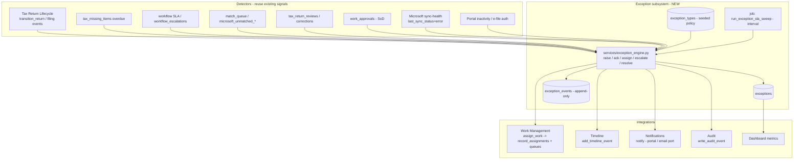
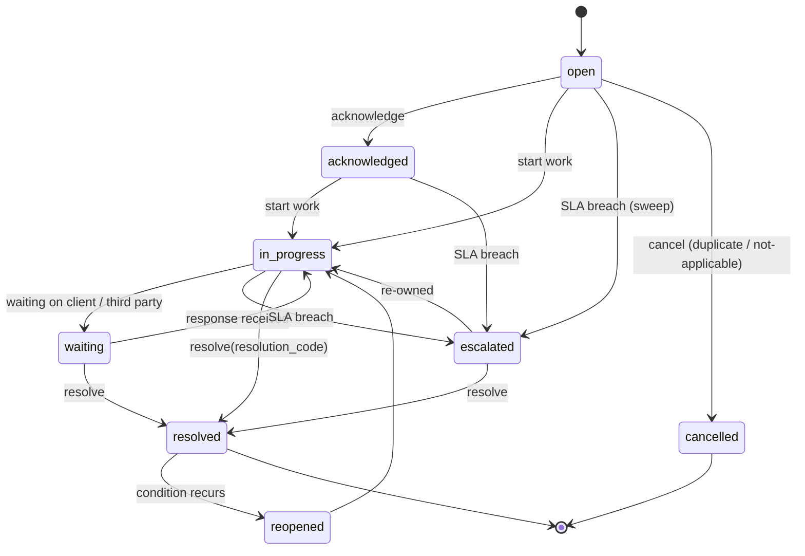

# Release 0.9.10 · Sprint 5.5 — Exception Engine (platform-wide; tax domain first)

**Status:** **Implemented** (Release 0.9.10 / Sprint 5.5, **tax domain only**) — Option B
delivered across eight phases (schema · service · detectors · SLA sweep · Work Management ·
API & staff console · client portal · dashboards/reporting) and validated by
[RC13](RC13_VALIDATION.md) (**SAFE TO MERGE**). Candidate head `q7b58f6c5d4e`.
**Baseline:** `main` @ v0.9.9 head `o5f36c4d3e2a`. **Release notes:** `docs/RELEASE_0.9.10.md`.
**Decision:** per **ADR-17** (`docs/PRODUCTION_ARCHITECTURE.md` §25 / `docs/ADR_EXCEPTION_ENGINE_SCOPE.md`)
this is a **platform-wide** Exception Engine — canonical tables `exceptions`,
`exception_events`, `exception_types` with a **required, CHECK-constrained `domain`** field
(`tax` | `wealth` | `operations` | `compliance` | `portal` | `microsoft`). **Sprint 5.5
implements `domain='tax'` only**; the other domains are schema-ready but not yet detected.
**Governing design:** `docs/PRODUCTION_ARCHITECTURE.md`. Every change must conform to it
(SQLAlchemy Core, capability-based RBAC, record-scope authorization, immutable
append-only audit, additive/reversible migrations, single Alembic head).

> **Naming note.** DB tables are `exceptions` / `exception_events` / `exception_types`; the
> service module is `app/services/exception_engine.py` (avoiding a clash with Python
> "exceptions"). The §3 catalog below is the **tax-domain** implementation — every catalog
> row is seeded with `domain='tax'`.

---

## 1. Purpose & scope

Client360 already detects and handles *specific* problems in isolation —
`tax_missing_items` (missing documents), `workflow_escalations` (SLA breaches),
`work_approvals` (segregation-of-duty), `tax_review_corrections` (review rework),
`match_queue` / `microsoft_unmatched_*` (human-review queues), and lifecycle states
`awaiting_information` / `rejected`. There is **no unified concept of an "exception"**:
no single place to see everything blocking a return, no consistent severity/owner/SLA/
escalation/resolution model, and no cross-cutting reporting.

**Sprint 5.5 introduces a canonical Tax Exception Management subsystem** that unifies
these signals into one typed, owned, SLA-bound, auditable record with a consistent
lifecycle — while **reusing** (not replacing) the existing detectors and services.

### Goals
- One canonical `exceptions` record spanning six categories: **client, workflow,
  document, filing, compliance, operational**.
- Every exception has a defined **trigger, severity, owner, workflow, escalation,
  notification, SLA, resolution, and audit** profile.
- Integrates with Tax Return Lifecycle, Work Management, Timeline, Portal, Microsoft
  notifications, Dashboard metrics, and the Audit log.

### Non-goals (this sprint)
- Replacing `tax_missing_items` / `workflow_escalations` / `work_approvals`. These
  remain the domain detectors; exceptions *reference* them.
- Delivering the real outbound email/SMS/Graph `sendMail` provider (the notification
  **port** is used; email/SMS remain stubbed as today — §9, §11).
- Multi-tenant / cross-firm exception routing (post-1.0).

### Principles
- **Additive & reversible.** New tables, triggers, seed rows, indexes; one new Alembic
  head; no destructive change to existing tables.
- **Reuse the service layer.** Route to work via `assign_work`; notify via `notify`;
  record via `add_timeline_event` and `write_audit_event`; mirror the
  `workflow_escalations` SLA-sweep pattern.
- **Idempotent detection.** A `dedupe_key` prevents duplicate open exceptions for the
  same underlying condition.
- **Immutable audit.** An append-only `exception_events` ledger (DB trigger) plus
  `audit_events` on every transition.
- **Record-scope authorization.** Exceptions are scoped to a return/person/household
  and enforced by the canonical record-scope service (H-series hardening).

---

## 2. Architecture



**Placement.** A new service module `app/services/exception_engine.py` owns the lifecycle
and the detector hooks. A new scheduler job `run_exception_sla_sweep`
(`app/jobs/scheduler.py`, interval) drives SLA/escalation/notification cadence, mirroring
the existing `run_workflow_sla_automation` (5-minute) job. Detectors call
`raise_exception(...)`; existing flows gain **additive, non-behavior-changing hooks**.

---

## 3. Exception taxonomy

### 3.1 Common attribute model (applies to every exception type)

| Attribute | Meaning | Where stored |
|---|---|---|
| **Trigger** | The condition that raises it (auto detector or manual) | `exception_types.trigger_kind` + detector |
| **Severity** | `blocker` \| `high` \| `medium` \| `low` | `exceptions.severity` (default from type) |
| **Owner** | Responsible role/team/user | `owner_user_id` / `owner_team_id` via `assign_work` |
| **Workflow** | State machine (§4) + resolution path | `exceptions.status` + `exception_events` |
| **Escalation** | Level bumps + reassignment on SLA breach | `escalation_level`, `exception_types.escalation_policy` |
| **Notification** | Who is told, on which channel, cadence | `exception_types.notification_policy` + `notify` |
| **SLA** | Time-to-resolve target | `sla_due_at` (opened_at + type `sla_minutes`) |
| **Resolution** | Allowed outcomes + who may close | `resolution_code`, `exception_types.resolution_options` |
| **Audit** | Immutable record of every change | `exception_events` + `audit_events` |

### 3.2 Severity → SLA / escalation defaults

| Severity | Meaning | Default SLA | Escalation cadence | Blocks lifecycle? |
|---|---|---|---|---|
| **blocker** | Return cannot progress / filing at risk / compliance breach | 24h | every 4h, +1 level | Yes (gates transitions) |
| **high** | Significant risk to timeline/quality | 2 business days | daily, +1 level | Advisory gate |
| **medium** | Needs attention, not blocking | 5 business days | every 2 days | No |
| **low** | Informational / cleanup | 10 business days | weekly | No |

### 3.3 Exception catalog (per category)

Each row: **code — trigger — severity — owner — escalation — notification — SLA —
resolution**. All emit timeline + audit events.

#### Client exceptions (owner default: **advisor**)
| Code | Trigger | Sev | Escalation | Notification | SLA | Resolution |
|---|---|---|---|---|---|---|
| `CLIENT_UNRESPONSIVE` | Missing item overdue ≥ N days or no portal activity | medium→high (ages) | advisor → wealth team lead | Portal + email to client; in-app to advisor | 5 bd | client responds / advisor logs contact / withdraw |
| `CLIENT_EFILE_AUTH_MISSING` | Return in `awaiting_efile_authorization` > threshold | high | advisor → manager | Portal (action needed) + email | 2 bd | client authorizes / advisor overrides with note |
| `CLIENT_ENGAGEMENT_UNSIGNED` | Engagement letter unaccepted at prep start | medium | advisor | Portal + email | 5 bd | letter accepted / manual waiver |
| `CLIENT_INFO_INCONSISTENT` | Questionnaire/organizer conflict flagged | high | advisor → preparer | In-app; portal clarification request | 3 bd | client clarifies / preparer resolves |

#### Workflow exceptions (owner default: **operations**)
| Code | Trigger | Sev | Escalation | Notification | SLA | Resolution |
|---|---|---|---|---|---|---|
| `WORKFLOW_SLA_BREACH` | `workflow_escalations` raised (step past `due_at`) | high | ops → team lead → manager | In-app to owner + escalation target | per step | step completed / reassigned / SLA waived |
| `WORKFLOW_STUCK` | No step progress ≥ N days on active instance | medium | ops → manager | In-app | 3 bd | unblock / cancel branch |
| `WORKFLOW_STEP_FAILED` | Automation action error (`automation_actions`) | high | ops → administrator | In-app + email to ops | 1 bd | retry / manual complete |
| `WORKFLOW_DEADLOCK` | Unsatisfiable step dependency | high | ops → administrator | In-app | 2 bd | edit workflow / cancel |

#### Document exceptions (owner default: **tax preparer / operations**)
| Code | Trigger | Sev | Escalation | Notification | SLA | Resolution |
|---|---|---|---|---|---|---|
| `DOC_MISSING_OVERDUE` | `tax_missing_items` past `due_date` (required) | medium→high | preparer → advisor | Portal request + email to client; in-app to preparer | from due_date | doc received / marked N/A |
| `DOC_AMBIGUOUS_MATCH` | `match_queue` below auto-match threshold | medium | ops → preparer | In-app | 3 bd | human match / reject |
| `DOC_REVIEW_REJECTED` | Tax document review rejected | medium | preparer | In-app; portal re-request | 3 bd | corrected doc / accepted |
| `DOC_UNREADABLE` | Upload invalid/corrupt/mismatched identifiers | low→medium | preparer | Portal re-request | 3 bd | re-upload |

#### Filing exceptions (owner default: **tax preparer → manager**)
| Code | Trigger | Sev | Escalation | Notification | SLA | Resolution |
|---|---|---|---|---|---|---|
| `FILING_REJECTED` | Return enters lifecycle `rejected` / filing `rejected` | **blocker** | preparer → manager → partner | In-app + email to preparer/manager; portal (status) | 24h | correct + `resubmitted` → `filed` |
| `FILING_DEADLINE_AT_RISK` | Statutory deadline within X and not `ready_to_file` | high→blocker | preparer → manager → partner | In-app + email; portal reminder | rolling | file / extension engagement |
| `FILING_TRANSMISSION_ERROR` | Filing provider/transmission failure (op overlap) | **blocker** | preparer → administrator | In-app + email | 4h | retry / manual file |
| `FILING_AMENDMENT_REQUIRED` | Post-acceptance correction needed | high | preparer → manager | In-app; portal notice | 5 bd | amended return engagement |

#### Compliance exceptions (owner default: **compliance**; audit-critical)
| Code | Trigger | Sev | Escalation | Notification | SLA | Resolution |
|---|---|---|---|---|---|---|
| `COMPLIANCE_SIGNOFF_MISSING` | Return advanced past required manager/partner review | **blocker** | compliance → partner | In-app to compliance + manager | 24h | obtain sign-off / revert transition |
| `COMPLIANCE_SOD_VIOLATION` | Same user prepared & approved (independent-approver breach) | **blocker** | compliance → administrator | In-app to compliance | 24h | independent re-approval |
| `COMPLIANCE_ACCESS_ANOMALY` | Repeated record-scope denials / unusual access pattern | high | compliance | In-app to compliance | 2 bd | investigate / dismiss with note |
| `COMPLIANCE_RETENTION_RISK` | Missing required document class at completion | medium | compliance → advisor | In-app | 5 bd | remediate / waive |

#### Operational exceptions (owner default: **operations / administrator**)
| Code | Trigger | Sev | Escalation | Notification | SLA | Resolution |
|---|---|---|---|---|---|---|
| `OPS_MICROSOFT_SYNC_FAILED` | `microsoft_accounts.last_sync_status = error` | medium→high | ops → administrator | In-app to ops | 2 bd | reconnect / retry |
| `OPS_TOKEN_RECONNECT_REQUIRED` | Silent refresh fails (reconnect message) | high | ops → administrator | In-app + email | 1 bd | reconnect Microsoft 365 |
| `OPS_JOB_FAILURE` | Scheduler job raises repeatedly | high | administrator | In-app to admin | 1 bd | fix / restart |
| `OPS_IMPORT_ERROR` | Schwab/portfolio import failure | medium | ops | In-app | 3 bd | re-import / correct file |

---

## 4. Exception lifecycle (state machine)



- `escalated` is a status *and* increments `escalation_level` (an exception can be
  escalated multiple times; level tracks how far).
- `resolved` requires a `resolution_code` valid for the type; `blocker` exceptions
  additionally gate the lifecycle transition they block (§6.1) until resolved.
- `reopened` is used when a detector re-fires for a previously resolved condition
  (dedupe reactivation) — see §5.4.

---

## 5. Database model

New tables (Core, `app/db.py` + `app/database/schema.py`), all additive.

### 5.1 `exception_types` (reference/policy — seeded by migration)
| Column | Type | Notes |
|---|---|---|
| `id` | PK | |
| `domain` | String, **CHECK** | `tax` \| `wealth` \| `operations` \| `compliance` \| `portal` \| `microsoft`; Sprint 5.5 seeds only `tax` |
| `code` | String, **unique** | e.g. `FILING_REJECTED` |
| `category` | String | client/workflow/document/filing/compliance/operational (CHECK) — a within-domain grouping |
| `name`, `description` | String/Text | |
| `default_severity` | String | blocker/high/medium/low (CHECK) |
| `trigger_kind` | String | `auto` \| `manual` |
| `default_owner_role` | String | roles.code (advisor/operations/compliance/tax_preparer/administrator) |
| `default_owner_team` | String | teams.code (wealth/tax/operations/compliance) |
| `sla_minutes` | Integer | drives `sla_due_at` |
| `escalation_policy` | JSON | `[{after_minutes, to_role|to_team, level}]` |
| `notification_policy` | JSON | `{staff:[channels], client:bool, cadence_minutes}` |
| `resolution_options` | JSON | allowed `resolution_code`s |
| `blocks_lifecycle` | Boolean | blocker gate (§6.1) |
| `compliance_visible` | Boolean | always surfaced to compliance |
| `active` | Boolean | |

### 5.2 `exceptions` (canonical record)
| Column | Type | Notes |
|---|---|---|
| `id` | PK | |
| `exception_type_id` | FK → `exception_types` | |
| `domain` | String, **CHECK** | denormalized from the type for domain-scoped filtering/authorization; Sprint 5.5 rows are all `tax` |
| `category`, `severity`, `status` | String (CHECK) | denormalized for fast filtering/indexing |
| `title`, `description` | String/Text | |
| `source` | String | `system` \| `manual` \| `portal` \| `microsoft` |
| **Scope** `tax_engagement_return_id` | FK, nullable | primary scope for `domain='tax'` |
| `tax_engagement_id`, `person_id`, `household_id` | FK, nullable | derived scope for authorization + timeline (record-scoped domains) |
| `workflow_instance_id`, `workflow_step_id`, `document_id` | FK, nullable | contextual links |
| `related_entity_type`, `related_entity_id` | String/Int | polymorphic link to the triggering row (e.g. `tax_missing_item`, `match_queue`, `tax_filing_event`, `workflow_escalation`) |
| **Ownership** `owner_user_id`, `owner_team_id` | FK, nullable | set via `assign_work` |
| `assignment_id` | FK → `record_assignments`, nullable | the work assignment |
| **SLA** `opened_at`, `sla_due_at`, `acknowledged_at`, `resolved_at` | DateTime tz | |
| `escalation_level` | Integer, default 0 | |
| `last_notified_at`, `notification_count` | DateTime / Integer | cadence control |
| `resolution_code`, `resolution_notes`, `resolved_by_user_id` | String/Text/FK | |
| **Idempotency** `dedupe_key` | String, **unique** (partial: where status not in resolved/cancelled) | prevents duplicate open exceptions |
| `created_by_user_id`, `created_at`, `updated_at` | | |

Partial-unique index: `UNIQUE (dedupe_key) WHERE status NOT IN ('resolved','cancelled')`
so a condition can recur after closure but never double-open.

### 5.3 `exception_events` (append-only ledger)
| Column | Type | Notes |
|---|---|---|
| `id` | PK | |
| `exception_id` | FK → `exceptions` | |
| `event_type` | String | opened/acknowledged/assigned/escalated/notified/waiting/resolved/cancelled/reopened/comment |
| `from_status`, `to_status` | String, nullable | |
| `actor_user_id` | FK, nullable | null = system/scheduler |
| `portal_account_id` | FK, nullable | client-driven events |
| `metadata` | JSON | channel, escalation target, reason, dedupe info |
| `created_at` | DateTime tz | |

**Append-only** via trigger (same idiom as `assignment_events` /
`tax_return_lifecycle_events`):
```sql
CREATE FUNCTION prevent_exception_event_mutation() RETURNS trigger AS $$
BEGIN RAISE EXCEPTION 'exception_events are append-only'; END; $$ LANGUAGE plpgsql;
CREATE TRIGGER exception_events_immutable BEFORE UPDATE OR DELETE
  ON exception_events FOR EACH ROW EXECUTE FUNCTION prevent_exception_event_mutation();
```

### 5.4 Indexes (hot paths, Phase-4 style)
`exceptions(domain, status)`, `(tax_engagement_return_id)`, `(person_id)`, `(household_id)`,
`(status, severity)`, `(category, status)`, `(owner_user_id)`, `(owner_team_id)`,
`(sla_due_at) WHERE status NOT IN ('resolved','cancelled')` (partial, for the SLA sweep),
`exception_events(exception_id)`. FK columns indexed per the Phase-4 policy.

### 5.5 Domain model & scoping

`domain` (CHECK-constrained, extensible by a later additive migration) partitions the
engine. Domains differ in how a row is *scoped* for authorization:

| Domain group | Domains | Scope | Authorization |
|---|---|---|---|
| Record-scoped | `tax`, `wealth`, `portal` | person / household (via the FK scope columns) | canonical record-scope service; `record.read_all` sees firm-wide |
| System-scoped | `operations`, `microsoft` | firm/system (no client) | `record.read_all` / admin/ops capabilities |
| Mixed | `compliance` | record- or firm-scoped per type | compliance capability + scope |

The scope check branches on `domain` from day one so future domains inherit it. Sprint 5.5
builds only the `tax` (record-scoped) path; system-scoped handling is designed but unused.

---

## 6. Integration points

### 6.1 Tax Return Lifecycle (`app/services/tax_return_lifecycle.py`)
- **Raise hooks (additive):** `transition_return` calls `exceptions` detectors after
  a successful transition — entering `rejected` → `FILING_REJECTED`; prolonged
  `awaiting_information` → `CLIENT_UNRESPONSIVE` / `DOC_MISSING_OVERDUE`; advancing past a
  required review without sign-off → `COMPLIANCE_SIGNOFF_MISSING`.
- **Blocker gate:** before allowing a transition, `transition_return` checks for an open
  `blocks_lifecycle` exception scoped to the return that targets the *next* state
  (e.g. cannot leave `filed`→`accepted` while a `FILING_REJECTED` blocker is open unless
  `force=True` with capability + audit). This reuses the existing `force` parameter.
- Resolving a `FILING_REJECTED` exception can drive `filing → resubmitted → filed`
  through the existing `FILING_TRANSITIONS`.

### 6.2 Work Management (`app/services/work_management.py`)
- Exceptions are assignable work: `assign_work(entity_type="exception",
  entity_id=<id>, assignment_role="primary", user_id/team_id=..., ...)` — reuses
  `record_assignments` + `work_assignment_details` + `assignment_events` + timeline +
  audit. `entity_type` gains a `exception` member (additive to the accepted set).
- New seeded `work_queues`: `exceptions` (`required_capability=tax.read`),
  `exceptions_critical` (blocker/high; `tax.review`), `compliance_exceptions`
  (`compliance` capability). Exceptions appear in My Work / Team Work via the existing
  queue mechanism and SLA/priority scoring (`work_intelligence`), with `sla_due_at`
  mapped from the exception.

### 6.3 Timeline (`app/services/timeline.py`)
- Every exception event → `add_timeline_event(source="exception",
  event_type="exception_<event>", title=..., person_id=, household_id=,
  external_id="tax-exception-<id>-<event>-<uuid>", event_metadata={...})`. Client-visible
  events (source restricted) appear on the client timeline; internal ones stay staff-side.

### 6.4 Portal (`app/portal/service.py`)
- Client-facing exceptions (`CLIENT_*`, `DOC_MISSING_OVERDUE`, `CLIENT_EFILE_AUTH_MISSING`)
  surface as **"Action needed"** items on the portal dashboard and, where a document is
  needed, create/refresh a `portal_document_requests` row and a `portal_notifications`
  entry via `notify(...)`. Portal actions (upload, authorize) resolve or advance the
  linked exception through the portal principal (record-scope enforced).
- Portal isolation is unchanged: clients see only exceptions scoped to their reachable
  person/household set (`portal_scope`).

### 6.5 Microsoft notifications
- Staff notifications use `notify(account_id, notification_type, title, body, *,
  channel=..., idempotency_key=...)`. `in_app` is delivered today; **`email`/`sms`/`push`
  use the notification provider port and are stubbed** (`DisabledNotificationHook`) — the
  design dispatches to them so that, when the outbound email / Microsoft Graph `sendMail`
  provider is wired (post-1.0), escalation emails deliver with no exception-code change.
  `idempotency_key` (derived from exception id + cadence bucket) prevents duplicate sends.
- Operational exceptions themselves *watch* Microsoft health
  (`OPS_MICROSOFT_SYNC_FAILED`, `OPS_TOKEN_RECONNECT_REQUIRED`) sourced from the Phase-1
  `microsoft_accounts.last_sync_status` / reconnect signals.

### 6.6 Dashboard metrics
- Extend `production_dashboard` (tax) and the work dashboard with an `exceptions` block:
  counts by category and severity, `open`, `overdue` (past `sla_due_at`),
  `escalated`, `blocking_now` (open blockers gating a return), and **MTTR** (mean
  `resolved_at - opened_at`). A dedicated exception console (§8) provides drill-down.

### 6.7 Audit log (`app/security/audit.py`)
- Every raise/ack/assign/escalate/resolve/cancel writes `write_audit_event(action=
  "exception.<verb>", entity_type="exception", entity_id=..., actor_user_id=,
  request_id=, metadata=...)` into the immutable `audit_events`, in addition to the
  append-only `exception_events` ledger. Compliance exceptions are always audited and
  surfaced to the compliance role regardless of assignment.

---

## 7. API additions

New router `app/routes/exceptions.py`, prefix `/exceptions` and `/api/v1/exceptions`
(platform-wide; `?domain=tax` filters — Sprint 5.5 serves only `tax`). Middleware `RULES`
gains an `^/exceptions` prefix mapping to a **new dedicated capability family**
`exception.*` (§9), placed with the other explicit carve-outs. (Route paths below shown as
`/exceptions...`.)

| Method & path | Capability | Purpose |
|---|---|---|
| `GET /exceptions` (HTML) · `GET /api/v1/exceptions` (JSON) | `exception.read` | List/filter (category, severity, status, owner, return) — record-scoped |
| `GET /api/v1/exceptions/{id}` | `exception.read` | Detail incl. event ledger |
| `POST /api/v1/exceptions` | `exception.write` | Manually raise an exception (type must be `trigger_kind=manual`) |
| `POST /api/v1/exceptions/{id}/acknowledge` | `exception.write` | Acknowledge |
| `POST /api/v1/exceptions/{id}/assign` | `exception.write` (+ `work.write`) | Assign owner/team (via `assign_work`) |
| `POST /api/v1/exceptions/{id}/escalate` | `exception.write` | Manual escalation |
| `POST /api/v1/exceptions/{id}/resolve` | `exception.write`; blocker → `exception.resolve`; compliance category → `exception.compliance` | Resolve with `resolution_code` |
| `POST /api/v1/exceptions/{id}/comment` | `exception.read` | Append a comment event |
| `GET /api/v1/exceptions/metrics` | `exception.read` | Aggregations for dashboards |
| `GET /api/v1/portal/exceptions` (+ resolve-via-action) | portal session | Client "action needed" items (record-scoped) |

All mutating endpoints enforce record-scope via the canonical authorization service and
CSRF (Origin/Referer) per existing middleware. Responses reuse the standard JSON envelope;
HTML pages render server-side (no raw-JSON user pages — per the demo UX review).

---

## 8. UI additions

- **Exception console** (`/exceptions`, template `tax/exceptions.html`, extends
  `base.html`): filterable table/cards — severity pill, category, title, scoped client,
  owner, SLA countdown (overdue highlighted), status; links to the return and the client.
  A detail drawer shows the event ledger and resolve/assign/escalate actions gated by
  capability.
- **Return detail:** an "Exceptions" panel on the tax return page listing open exceptions
  blocking or attached to the return.
- **Work / dashboards:** an "Exceptions" metric card (open / overdue / blocking) on the
  tax production dashboard and My Work; exception items surface in work queues.
- **Portal:** an "Action needed" section on the client dashboard listing client-facing
  exceptions with the relevant action (upload document, authorize e-file), reusing the
  existing portal document-request and message components.
- **Empty/error states:** friendly "No open exceptions" empty state; no raw-JSON pages.

---

## 9. Security model

- **RBAC (capability-based) — new dedicated capability family.** Today **only
  `administrator` holds any `tax.*` capability**, and there is no literal `compliance`
  capability (the compliance role has `audit.read`, `record.read_all`, `work.approve`).
  Reusing `tax.read` would therefore lock every non-admin owner out of the exception
  console. This sprint introduces a scoped family, seeded onto the appropriate roles by an
  **additive `role_capabilities` migration** (no role gains `record.read_all`, no "god"
  capability):
  - `exception.read` — view/list (→ advisor, operations, compliance, tax_preparer, administrator)
  - `exception.write` — raise / acknowledge / assign / escalate / resolve non-blocker (→ advisor, operations, tax_preparer, administrator)
  - `exception.resolve` — resolve **blocker** exceptions (sensitive; → tax_preparer/manager, administrator)
  - `exception.compliance` — resolve **compliance-category** exceptions (sensitive; → compliance, administrator)

  Assignment/escalation additionally respects the existing `work.write`. Operational
  admin exceptions map to `identity.manage`/administrator. Because tax capabilities are
  role-composed (not inherent to a role), the demo's `tax_preparer` role and any reviewer
  roles must be granted the family explicitly in the seed.
- **Record-scope authorization (domain-aware, §5.5):** for record-scoped domains
  (`tax`, `wealth`, `portal`) every read/mutation is checked against the return/person/
  household scope by the canonical record-scope service — staff see only their authorized
  book (firm-wide via `record.read_all` for administrator/compliance), clients only their
  reachable set (`portal_scope`). System-scoped domains (`operations`, `microsoft`) require
  `record.read_all` / admin-ops capabilities. The scope check branches on `domain`. Mirrors
  the H3/H6/H7 fixes. Sprint 5.5 exercises only the `tax` record-scoped path.
- **Segregation of duties:** compliance exceptions (`COMPLIANCE_SOD_VIOLATION`,
  `COMPLIANCE_SIGNOFF_MISSING`) may only be resolved by a user distinct from the one who
  triggered them, reusing the `requires_independent_approver` pattern from `work_approvals`.
- **Immutable audit:** `exception_events` is append-only (trigger); all transitions
  also write `audit_events`. Blocker overrides (`force`) require capability + are audited.
- **No secret exposure:** exceptions never store tokens/PII beyond the existing scoped
  identifiers; notification bodies are templated and avoid sensitive content.

---

## 10. Reporting

- **Dashboard metrics** (§6.6): category/severity/status counts, overdue, escalated,
  blocking-now, MTTR, and per-owner/per-team load.
- **Exception aging report:** open exceptions bucketed by age vs SLA (on-track / at-risk /
  breached), filterable by category and owner.
- **Compliance report:** all compliance-category exceptions with resolution and independent
  approver, exportable (CSV/JSON via an authorized API), sourced from the append-only
  ledger for defensibility.
- **SLA/velocity:** created vs resolved over 30 days, breach rate, mean/median MTTR —
  slotting alongside the existing `velocity_30_days` production metric.

---

## 11. Migration strategy

- **One new Alembic migration**, `down_revision = o5f36c4d3e2a`, new head (next in the
  established letter sequence, e.g. `p6a47e5d4f3b`). Single head maintained.
- **Additive only:** create `exception_types`, `exceptions`,
  `exception_events`; the append-only trigger; the indexes (via
  `CREATE INDEX CONCURRENTLY` inside an `autocommit_block`, per Phase 4, run in a
  low-traffic window); and the reference **seed** of:
  - `exception_types` (one row per catalog entry in §3.3);
  - the new `work_queues` rows (`exceptions`, `exceptions_critical`,
    `compliance_exceptions`);
  - the new `capabilities` (`exception.read/write/resolve/compliance`, the last two
    marked sensitive) and their `role_capabilities` grants (§9), via the established
    `INSERT ... SELECT ... FROM roles CROSS JOIN capabilities` idiom;
  - the `exception` addition to the `record_assignments` accepted `entity_type` set
    (`ENTITY_TYPES` in `work_management.py`).
- **No change to existing tables' data**; `tax_missing_items` / `workflow_escalations` /
  `work_approvals` are untouched (referenced, not migrated). Sentinel-preservation
  validated as in every release.
- **Downgrade:** drop the trigger, tables, indexes, and seeded queues; fully reversible.
- **Backfill (optional, dry-run-first, idempotent):** a one-time script may open exceptions
  for *currently* overdue `tax_missing_items`, active `workflow_escalations`, and
  `rejected` returns, using `dedupe_key` so re-runs are safe. Gated behind an explicit flag;
  not required for the schema migration.

---

## 12. Testing strategy

- **Unit:** severity→SLA computation; `dedupe_key` idempotency (raise twice → one open
  row; resolve then re-raise → reopened); state-machine legality (illegal transitions
  rejected); resolution-code validation per type.
- **Integration (per category):** a detector fires → exception opened with correct
  owner/SLA → `assign_work` creates the assignment → timeline + audit written →
  `notify` dispatched (in-app delivered, email recorded-disabled). Identical-output where
  reusing existing services.
- **Lifecycle hooks:** entering `rejected` opens `FILING_REJECTED` and gates the blocked
  transition until resolved; resolving drives `resubmitted → filed`.
- **SLA sweep:** simulate past-`sla_due_at` exceptions → sweep escalates (level bump,
  reassignment, re-notify with idempotency) without duplicating notifications.
- **Authorization regression (re-run the H-series harness):** staff see only their scope;
  clients only their reachable set; compliance-only resolution enforced; SoD independent
  approver enforced; no cross-client leakage; firm-wide requires `record.read_all`.
- **Audit/immutability:** `exception_events` UPDATE/DELETE rejected by trigger;
  `audit_events` written for every verb.
- **Portal:** client "action needed" surfaces only in-scope exceptions; upload/authorize
  resolves the linked exception; portal isolation holds.
- **Migration:** clean base→head; v0.9.10 baseline up/down/re-up with sentinel
  preservation; single head; CONCURRENTLY indexes valid & planner-selected.
- **Full suite + startup/OpenAPI/route-count**; adversarial RC review (RC13) before merge,
  consistent with the release cadence.

---

## 13. Rollout / phasing (implementation milestones)

Delivered as independently reviewable phases (the established cadence):
1. **Schema + types seed** (tables, trigger, indexes, seed) — migration only.
2. **Core service** (`exceptions.py`: raise/ack/assign/escalate/resolve + dedupe).
3. **Detectors & lifecycle hooks** (additive, non-behavior-changing).
4. **SLA sweep job** (scheduler) + notifications.
5. **Work Management + queues** integration.
6. **API + staff exception console UI.**
7. **Portal "action needed" + client-facing exceptions.**
8. **Dashboards/reporting** + RC13 validation & release (0.9.10).

## 14. Risks & open questions (for review)

- **Blocker gating** on lifecycle transitions changes behavior for `force=False` callers.
  Confirm the exact states each blocker gates, and that `force` + capability is the agreed
  override.
- **Severity aging** (`medium→high`) — automatic escalation of severity vs. level only?
- **Client-visible exception copy** — which categories/codes are ever shown to clients,
  and the exact portal wording (avoid alarming/legal phrasing).
- **Backfill scope** — do we open exceptions for the existing demo/production backlog on
  first deploy, or start clean going forward?
- **Notification channels** — confirm email/SMS stay stubbed this sprint (port only), with
  real delivery deferred until the outbound provider lands.
- **Capability family** — confirm the new `exception.*` family and its role grants
  (advisor/operations/compliance/tax_preparer), rather than re-granting the broad `tax.*`
  set (today held only by `administrator`). Confirm which roles may resolve blocker vs
  compliance-category exceptions.
- **Work-queue matching** — exception items surface in work either via new
  `work_queues.criteria` keys (e.g. `category`, `severity`) understood by
  `work_intelligence.queue_matches`, or by mirroring each exception as a linked work item.
  Confirm which approach.
